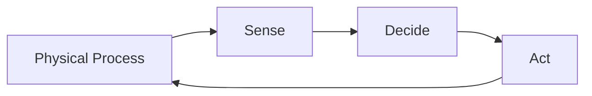
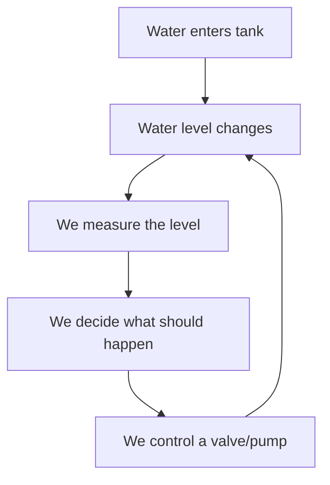
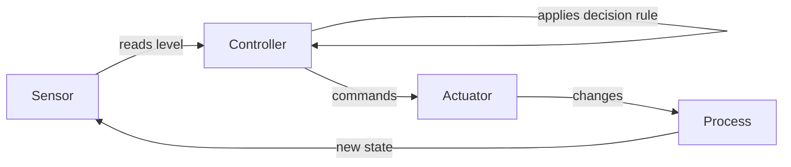
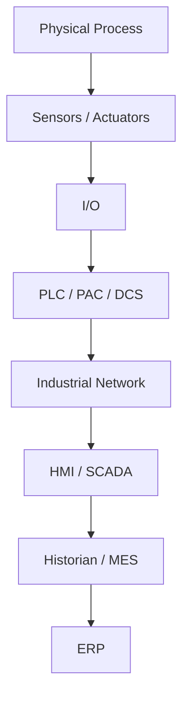

# What Is Industrial Automation?

[🚀 Open Interactive Article 01](https://qurvon.github.io/Industrial-Automation-from-First-Principles/01-fundamentals/01-what-is-industrial-automation.html)

> **QURVON Research Series — Article 01**
> Foundations of Industrial Automation, built from first principles.
> *This article answers one question only: "What is industrial automation, and what makes a system automated?" Deeper technical material (sensors, control theory, PLC internals, architecture) has its own dedicated chapters later in this series — see Section 11.*

---

## 1. The Problem Automation Solves

Before modern automation technologies existed, many industrial processes depended heavily on humans to observe, judge, and act.

A worker watching a boiler had to:
- **Observe** — look at a pressure gauge
- **Judge** — decide if the pressure was too high or too low
- **Act** — open or close a valve
- **Repeat** — do this continuously, without a break, without a mistake

This works, but it has hard limits:
- Humans get tired, distracted, and slow
- Humans can't watch 500 variables at once
- Humans can't react in milliseconds
- Humans can't work in toxic, extreme-heat, or high-radiation environments
- Human judgment is inconsistent between one person and another

Industrial automation exists to remove these limits — not by eliminating the *logic* of observing and reacting, but by moving that logic into a machine that can do it faster, longer, and more consistently than a person can.

---

## 2. What Is Automation?

**ISA (International Society of Automation)** defines automation as *the creation and application of technology to monitor and control the production and delivery of products and services.*

Two words carry all the weight in that sentence: **monitor** and **control**.

- **Monitor** = continuously acquire information about the real, physical state of something (a temperature, a level, a speed, a position).
- **Control** = use that information to decide on and execute an action that changes or maintains that physical state.

**NIST** describes an Industrial Control System (ICS) as a combination of electrical, mechanical, hydraulic, and pneumatic components that work together to achieve an industrial objective (e.g., manufacturing, transportation of matter or energy).

So automation is not "a computer running a factory." It is the *general principle* of replacing a human observing-and-reacting loop with a technological one.

**Key distinction:**

| Term | What it means | What it does NOT mean |
|---|---|---|
| Monitor | Continuously sense real-world state | Just "having a sensor installed" |
| Control | Decide + execute a corrective/maintaining action | Just "having an output wire" |

---

## 3. Automation vs Mechanization

These two are commonly confused, but they are fundamentally different concepts.

**Mechanization** = replacing human *muscle* with a machine.
> Example: A conveyor belt moves boxes instead of a person carrying them. A motor turns a shaft instead of a person cranking it.

Mechanization removes physical effort. It does **not** remove decision-making. A human still watches and decides when to start, stop, or adjust the machine.

**Automation** = replacing human *judgment and reaction* with a system that senses, decides, and acts on its own.
> Example: A level sensor detects the tank is full and the system decides — without a person — to close the inlet valve.

**The test:**
> If a motor replaces human muscle, that is mechanization.
> If a sensor detects a condition **and** a controller automatically decides what to do about it, that is automation.

Mechanization answers "how do we do the work?"
Automation answers "how do we decide what work to do, and when?"

In real industrial systems, mechanization and automation are layered together: automation supplies the decisions, mechanization supplies the physical muscle that carries them out.

---

## 4. The Fundamental Automation Loop

A large class of industrial automation systems can be understood through the same basic loop:

This **sense → decide → act** loop is one of the most useful mental models in this entire series — a single-tank level controller and a large section of a plant both run on some version of it.

But it's important to be precise here: **not every automated system is a closed feedback loop.** A system that measures its own result and adjusts based on it is *closed-loop*. A system that simply executes a pre-defined command *without* measuring the outcome is *open-loop* — for example, a timer-based irrigation valve that opens for 10 minutes regardless of whether the soil is actually wet enough afterward. Both are legitimate forms of automation. We'll draw this distinction properly in a dedicated chapter later in the series.

---

## 5. Automation Is Bigger Than Control

It's tempting, after seeing the loop above, to conclude that "automation" simply *means* continuous feedback control. It doesn't — that's only one piece of it.

Industrial automation, as a field, also includes:

- **Sequencing** — running a fixed series of steps in order (e.g., a batch mixing sequence)
- **Interlocking** — preventing unsafe or invalid actions (e.g., "don't open this valve unless that pump is off")
- **Coordination** — getting multiple machines to work together correctly
- **Monitoring & alarming** — flagging abnormal conditions for a human to see
- **Data acquisition** — recording process values over time
- **Recipe management** — storing and recalling parameter sets for different products
- **Diagnostics** — detecting and reporting equipment faults
- **Production tracking** — counting, timing, and logging output
- **Supervisory control** — coordinating and overseeing many lower-level control loops at once

The sense → decide → act loop is the foundation these are all built on, but treating automation as *only* that loop gives too narrow a mental model. Keep this list in mind as later chapters introduce each of these individually.

---

## 6. The Physical Process

The **process** is the real, physical thing you are trying to control. It is not the technology — it is the world the technology is acting on.

Common physical quantities that get automated:

| Process Variable | Real-world example |
|---|---|
| Temperature | Furnace, oven, chiller |
| Pressure | Boiler, pipeline, gas tank |
| Level | Water tank, silo, reservoir |
| Flow | Pipe carrying liquid or gas |
| Speed | Motor, conveyor, pump |
| Position | Robotic arm, valve actuator |

We'll follow one simple example — a water tank — through the rest of this article.

---

## 7. A Simple Real-World Example — The Water Tank

Walking the water tank through the four roles of the loop:

- **Sensor** — something (e.g., an ultrasonic sensor or float switch) measures the current water level and turns it into a signal the rest of the system can read. *Why it's needed:* without a sensor, the system has no way to know the real-world state at all — the exact mechanics of that conversion belong in the dedicated sensors chapter.
- **Controller** — receives that signal and applies a decision rule, such as: *if level drops below 20%, turn the pump on; if it rises above 90%, turn the pump off.* At its core, a controller is nothing more than: **receives information → applies a decision rule → produces an action.** The deeper question of *how* that decision rule is designed (simple on/off logic vs. more refined approaches) belongs in the control-fundamentals chapter.
- **Actuator** — the pump or valve that physically carries out the controller's decision, changing the real world in response to it.
- **Feedback** — the sensor reading the tank again after the actuator has acted, so the system can confirm whether the level actually moved the way it should have — and correct course if not. This is what makes the system self-correcting rather than blind.

That's the entire loop, in one concrete example — no more detail than that is needed yet.

---

## 8. Where the Major Technologies Fit

In a real facility, this loop doesn't run on its own — it's implemented and supervised by a stack of technologies:

A **PLC (Programmable Logic Controller)** is simply one common, industrial-hardened implementation of the "Controller" role in the loop above. Above it, systems like SCADA, historians, and MES supervise many such loops across a whole site; ERP sits above all of that, managing business-level planning.

*How does a PLC actually receive, process, and produce these signals at the electrical level? How does SCADA differ from an HMI? We'll investigate each layer of this stack from the ground up in later chapters.*

**NIST** describes **Operational Technology (OT)** broadly as the systems and devices that interact with the physical environment through monitoring and control — a description that spans this entire stack, from a single sensor up through the top of it.

---

## 9. First-Principles Mental Model

Strip away every brand name, product, and acronym, and industrial automation is this:

> **A field concerned with using technology, rather than continuous manual human effort, to monitor and control physical processes — most visibly through the sense → decide → act loop, but also through sequencing, interlocking, coordination, diagnostics, and supervisory functions built on top of it.**

- The **sensor** answers: *"What is actually happening right now?"*
- The **controller** answers: *"What should happen, and how do we get there?"*
- The **actuator** answers: *"How do we physically make that happen?"*
- **Feedback** answers: *"Did it actually work?"*

Every technology that appears later in this series — PLCs, SCADA, industrial networks, sensors, control algorithms — is a more elaborate way of implementing or supervising this same underlying idea.

---

## 10. Key Takeaways

- At its core, automation uses technology to **monitor and/or control** physical processes, while also enabling functions such as sequencing, interlocking, coordination, diagnostics, and supervision.
- Mechanization replaces **muscle**; automation replaces **judgment and reaction**.
- A large class of automated systems can be understood through: **Process → Sensor → Controller → Actuator → back to Process** — but not all automation is closed-loop, and automation is broader than feedback control alone (sequencing, interlocking, diagnostics, supervisory control, and more).
- A **PLC** is one specific, industrial-hardened implementation of the "Controller" role — its internals are a topic of their own.
- Real facilities stack many of these loops into a hierarchy: **Process → I/O → PLC → Network → SCADA → Historian/MES → ERP.**

---

## 11. What We'll Learn Next

This article deliberately stayed at the conceptual level. Each thread introduced here becomes its own dedicated chapter in `01-fundamentals/`:

| # | Article | What it covers |
|---|---|---|
| 02 | History and Evolution of Industrial Automation | Where did it come from? |
| 03 | Why Industrial Automation Exists | Safety, productivity, repeatability, quality, and the other drivers |
| 04 | Industrial Processes and Systems | What exactly are we automating — continuous, batch, discrete? |
| 05 | Measurement and Instrumentation Fundamentals | The general principles behind measuring a physical quantity |
| 06 | Sensors and Transducers | The full physical-quantity → electrical-signal conversion path |
| 07 | Signals and Data | How signals are represented, transmitted, and interpreted |
| 08 | Analog vs Digital | The two fundamental signal types in industrial systems |
| 09 | Actuators and Final Control Elements | How a decision becomes physical motion |
| 10 | Open-Loop vs Closed-Loop | The distinction introduced in Section 4, properly explained |
| 11 | Feedback and Control Fundamentals | How a controller's decision rule is actually designed (on/off, PID, and beyond) |
| 12 | Control System Components | How sensors, controllers, and actuators fit together as a system |
| 13 | Industrial I/O Fundamentals | Input/output modules, wiring, and conditioning |
| 14 | PLC Fundamentals | Scan cycles, memory, ladder logic, and PLC internals |
| 15 | Industrial Automation Architecture | The full I/O → PLC → Network → SCADA → MES → ERP stack, in depth |
| 16 | Information and Data Flow | How data moves up and down the architecture |
| 17 | A Real-World Automation System | A complete, end-to-end worked example |
| 18 | Fundamental Mental Model | Tying the entire series back together |

### Questions for Further Investigation

1. What exactly is a "process" — how do we classify continuous vs. batch vs. discrete processes?
2. What's the actual difference between open-loop and closed-loop automation, and when is each used?
3. How does an analog sensor signal (4–20 mA) actually get converted into a digital number inside a PLC?
4. What is the difference between a PLC, a PAC, and a DCS — and when is each one used?
5. How does PID control differ from simple ON/OFF (bang-bang) control?
6. What industrial network protocols (Modbus, Profibus, EtherNet/IP) carry these signals between devices?
7. What is the actual difference between SCADA and an HMI?

---

## References

- ISA (International Society of Automation) — definition of automation as the creation and application of technology to monitor and control production and delivery of products and services.
- NIST Special Publication 800-82 — *Guide to Industrial Control Systems (ICS) Security* — description of ICS components (electrical, mechanical, hydraulic, pneumatic) and control loop elements (sensors, controllers, actuators).
- NIST — description of Operational Technology (OT) as systems/devices interacting with the physical environment through monitoring and control.
- GitHub Docs — Mermaid diagram rendering support in Markdown; automatic outline generation from Markdown headings.

---

**Next:** [02 — History and Evolution of Industrial Automation](02-history-and-evolution-of-industrial-automation.md)
