# Why Does Industrial Automation Exist?

[📄👾 Open Interactive Article 03](https://qurvon.github.io/Industrial-Automation-from-First-Principles/01-fundamentals/03-why-industrial-automation-exists-2.html)

> If humans can operate machines, why do we need PLCs, sensors, control systems, robots, and networks at all?

Sit with that question for a moment before reading on. It's the real question this chapter answers — not "what are the benefits of automation" (a list), but **why a factory full of capable, intelligent humans still isn't enough.**

The short answer: **automation exists because industrial processes have requirements — of scale, speed, precision, continuity, safety, and complexity — that humans alone cannot reliably satisfy.** Not because humans are bad at their jobs. Because human biology was never built for what modern industry demands.

Everything else in this chapter is that one sentence, unpacked.

---

## Table of Contents

1. [Two Ways to Run a Process](#1-two-ways-to-run-a-process)
2. [Before Automation: What Problem Were Humans Actually Facing?](#2-before-automation-what-problem-were-humans-actually-facing)
3. [The Fundamental Problem — Humans Are Not Control Systems](#3-the-fundamental-problem--humans-are-not-control-systems)
4. [Reason One: Productivity](#4-reason-one-productivity)
5. [Reason Two: Consistency and Repeatability](#5-reason-two-consistency-and-repeatability)
6. [Reason Three: Precision](#6-reason-three-precision)
7. [Reason Four: Speed and Response Time](#7-reason-four-speed-and-response-time)
8. [Reason Five: Safety](#8-reason-five-safety)
9. [Reason Six: Continuous Operation](#9-reason-six-continuous-operation)
10. [Handling Complexity](#10-handling-complexity)
11. [Human + Machine, Not Human vs. Machine](#11-human--machine-not-human-vs-machine)
12. [The Economics of Automation](#12-the-economics-of-automation)
13. [Why Not Automate Everything?](#13-why-not-automate-everything)
14. [The Real Engineering Answer](#14-the-real-engineering-answer)
15. [The First-Principles Explanation](#15-the-first-principles-explanation)
16. [One Complete Example — Automatic Tank-Level Control](#16-one-complete-example--automatic-tank-level-control)
17. [From One Sensor to an Entire Enterprise](#17-from-one-sensor-to-an-entire-enterprise)
18. [The Final Question](#18-the-final-question)
19. [Chapter Summary](#19-chapter-summary)
20. [References](#20-references)

---

## 1. Two Ways to Run a Process

Every industrial process, at its core, can be run one of exactly two ways.

**Way one — a human runs the loop:**


*A human-run control loop, 1913: observe, decide, act, check — repeated by a person, all day, every day. (Source: [Wikimedia Commons](https://commons.wikimedia.org/wiki/File:Ford_assembly_line_-_1913.jpg), public domain)*

```
Human → observes → decides → acts → checks result → observes again
```

**Way two — a system runs the loop:**

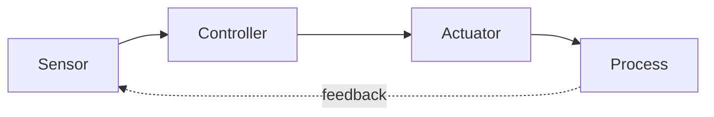

Both loops are, structurally, the *same loop*. The difference is what sits at the center of it: a nervous system running on judgment and glucose, or a controller running on electricity and code.

That single substitution — human judgment replaced by a sensor-controller-actuator loop — is the entire subject of this chapter. Everything that follows is really just answering one question from six different angles: **when, and why, does that substitution become necessary?**

---

## 2. Before Automation: What Problem Were Humans Actually Facing?

Don't start with PLCs. Start with the factory floor, and what changed on it.

As industry matured, several things grew at once:

- **Machines got larger** — one machine could now do the work of what used to take twenty people.
- **Production volumes increased** — markets wanted thousands of units, not dozens.
- **Processes got faster** — a line that used to run at walking pace now ran faster than a human could track by eye.
- **More variables needed control simultaneously** — temperature *and* pressure *and* flow *and* speed *and* position, all at once, all changing.
- **Operations became repetitive** to a degree no human role had ever demanded before — the same six-second motion, thousands of times a shift.
- **Environments became genuinely dangerous** — high heat, high voltage, toxic gases, moving machinery with no tolerance for a lapse in attention.
- **Quality expectations tightened** — a customer receiving unit #40,000 expected it identical to unit #1.
- **Production needed to run continuously** — stopping and restarting some processes wastes enormous energy and money, or is outright unsafe.

None of this happened because engineers wanted to remove people. It happened because the *processes themselves* outgrew what a human operator, alone, could reliably hold in their hands and their head at the same time.

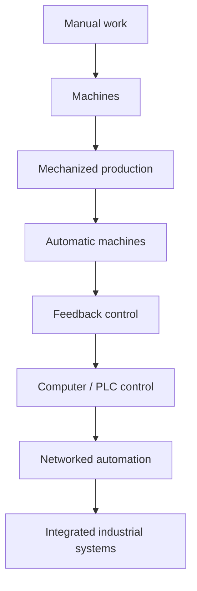

This is the same evolutionary spine covered in Chapter 02 — but here we're not asking *how* it happened historically. We're asking *why* it had to happen at all.

---

## 3. The Fundamental Problem — Humans Are Not Control Systems

Here is the idea this whole chapter turns on, and it's worth sitting with honestly: **a human being is an extraordinarily capable general-purpose agent, and an extraordinarily poor industrial control system.** Those two facts are not in tension — they're both true, at the same time, about the same person.

You can be a skilled, attentive, conscientious operator and *still* be physically incapable of doing what a $200 sensor and a control loop do without effort. That's not a character flaw. It's biology.

| Requirement | Human | Automated System |
|---|---|---|
| Repetition, thousands of cycles | Attention degrades | No degradation |
| Reaction time | ~200–300 ms, at best | Milliseconds or less |
| Continuous operation (24/7) | Needs rest, shifts, breaks | Runs uninterrupted |
| Precision under fatigue | Drifts over a shift | Holds constant |
| Exposure to hazardous conditions | Real risk to life | Can be physically isolated |
| Simultaneous variable monitoring | 3–4 variables, realistically | Hundreds, continuously |
| Data logging | Sparse, error-prone | Complete, timestamped |
| Consistency across operators/shifts | Varies person to person | Identical regardless of who's on shift |

Picture one person trying to watch **temperature, pressure, flow, speed, position, and quality** — six live variables — on three machines running simultaneously, for eight hours, without a single lapse. Nobody can actually do that. Not because they're not trying hard enough — because sustained, divided, high-stakes attention is not something the human brain was built to deliver indefinitely.

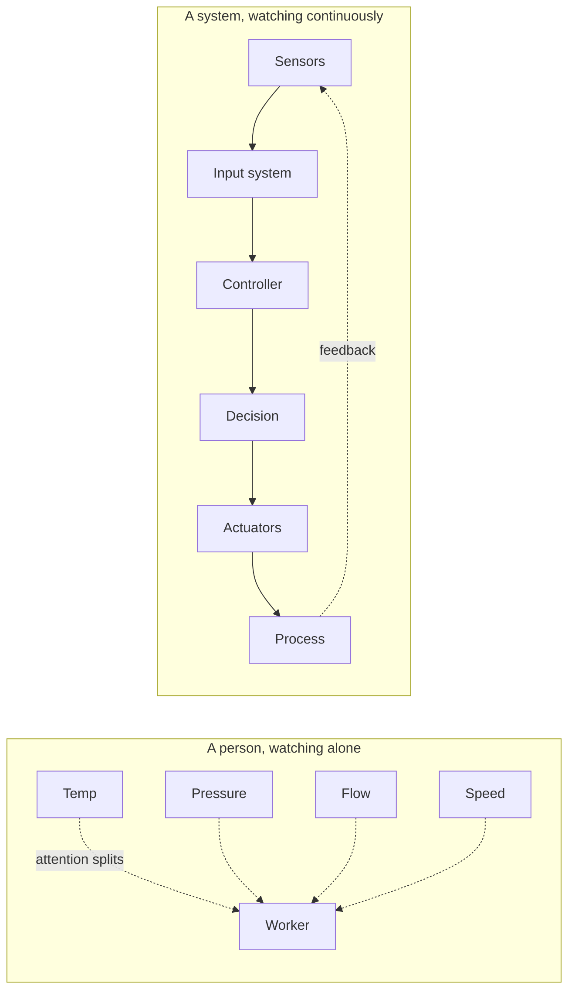

Now hold that image next to this reframe, because it changes everything that follows: **automation isn't a judgment on human ability. It's an acknowledgment of human physiology.** You would not ask a person to hold their arm perfectly steady at exactly 500 grams of pressure for eight straight hours either — not because they're weak, but because muscles don't work that way. Industrial variables don't work that way either.

---

## 4. Reason One: Productivity

The most obvious reason automation exists, and the easiest one to underestimate the depth of.

A person works, and then a person rests. That's not a flaw — it's the correct, healthy design of a human body. But it means manual production has a built-in, unavoidable rhythm of output and pause.

```
Manual:      Work → Rest → Work → Rest → Work → Rest
Automated:   Work → Work → Work → Work → Work → Work
```

A machine has no circadian rhythm, no fatigue curve, no need to eat lunch. It performs the same operation at the same rate for as long as it has power, material, and maintenance. That's not "working harder" in any moral sense — it's simply a different category of thing, operating under different physical constraints than a human body.

---

## 5. Reason Two: Consistency and Repeatability

This is where automation stops being about *how much* and starts being about *how well* — and it's a psychologically important distinction, because it's not about effort at all.


*An automated filling line — the same fill volume, run after run, without the operator ever touching a valve. (Source: [Wikimedia Commons](https://commons.wikimedia.org/wiki/File:Bottling_machine_at_Planeta_winery.jpg))*

> Automation doesn't get bored, distracted, or gradually drift in technique during a repetitive task. It has no technique to drift. It has a setpoint.

Take something as simple as filling bottles to a 500 mL target.

**Manual filling**, honestly rendered:
```
497 mL → 503 mL → 501 mL → 506 mL → 495 mL → 499 mL ...
```

**Automated filling**, honestly rendered — because real systems have tolerances too, not physical perfection:
```
500.1 mL → 499.9 mL → 500.0 mL → 500.2 mL → 499.8 mL ...
```

Notice what changed: not that the automated system is *magically perfect* — it still varies. What changed is the **width of the variation**. A trained, attentive worker might hold a process within a few percent. A properly tuned control loop can often hold that same process within a fraction of a percent, indefinitely, without ever getting tired of doing it.

This matters more than it sounds like it should, because *variation compounds*. A car with 30,000 parts, each individually "close enough," can add up to a vehicle that doesn't fit together. Repeatability isn't a nice-to-have in that context — it's the only way modern manufacturing tolerances are physically achievable at all.

---

## 6. Reason Three: Precision

Some processes don't just need *consistency* — they need **accuracy against a physical target** that a human hand literally cannot achieve unassisted: positioning within microns, holding a temperature within a fraction of a degree, timing an event to the millisecond.

A CNC machine is the clearest example of this in daily industrial life.


*A CNC machine holding tolerances no human hand can match, cut after cut. (Source: [Wikimedia Commons](https://commons.wikimedia.org/wiki/File:CNC_Mill_1.jpg), CC BY-SA 4.0)*

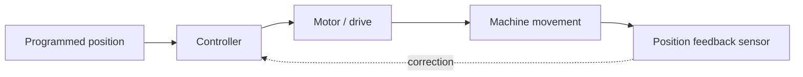

This is your first real look at **closed-loop control**, a concept the rest of this repository builds on constantly: the controller doesn't just send a command and hope. It sends a command, *measures what actually happened*, compares that to what it wanted, and corrects the difference — continuously. No human muscle group has that kind of built-in position feedback at micron resolution. A servo motor does.

---

## 7. Reason Four: Speed and Response Time

Human reaction time, even for a highly trained, alert operator, sits around 200–300 milliseconds *at best* — and that's for a simple, expected stimulus. For something abnormal, in the middle of a shift, amid other distractions, it's slower and less reliable than that.

Some industrial events don't leave that kind of time.

```
Sensor detects abnormal condition
          ↓
Controller evaluates against limits
          ↓
Output changes
          ↓
Actuator responds
```

Picture a reactor temperature climbing toward a safety limit:

```
Temperature
 ↑
 │                                    ╱── uncontrolled path
 │                              ╱────
 │                        ╱────
 │                  ╱────
─┼──────────────────────────────────────→ Target / limit
 │  ← controller intervenes here, in milliseconds
```

A controller evaluating that same sensor signal can respond in single-digit milliseconds — opening a cooling valve, cutting a heater, or tripping an interlock before a human would have finished *registering* that something was wrong, let alone acting on it. This isn't a knock on human competence. It's a plain fact about nerve conduction velocity versus electrical signal propagation. One is biological; the other, physical.

---

## 8. Reason Five: Safety

Automation is not fundamentally about replacing workers. In a large share of real installations, its actual job is to **keep people alive** — by detecting danger faster than a person can, and acting on it without hesitation.


*A safety device built for one job: stop hazardous motion the instant it's triggered, with no delay for judgment. (Source: [Wikimedia Commons](https://commons.wikimedia.org/wiki/File:Emergency_stop_button.jpg))*

Automation contributes to safety by:

- Detecting dangerous conditions (gas leaks, overpressure, overtravel) faster than a human could notice them.
- Isolating hazardous processes so a person never has to be physically present in the danger zone.
- Stopping machinery automatically the instant an unsafe condition is confirmed.
- Monitoring environments that are unsafe for continuous human presence (extreme heat, radiation, confined spaces, toxic atmospheres).
- Holding operating conditions inside a controlled, predictable envelope instead of letting them drift toward failure.

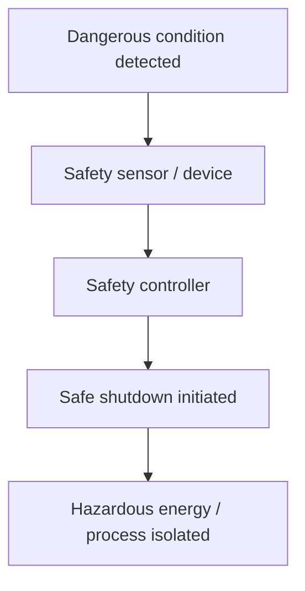

**One important distinction, worth being precise about:** ordinary process control (a PLC running a conveyor, a loop holding a temperature) is not automatically the same thing as *functional safety* (a certified safety instrumented system designed, tested, and rated specifically to prevent harm). A standard PLC can fail. Safety systems are engineered — with redundancy, certification, and independent verification — specifically for the case where something else has already gone wrong. Later chapters in this repository draw that line carefully; it's one of the most consequential distinctions in all of industrial automation.

---

## 9. Reason Six: Continuous Operation

Some processes are not simply *helped* by running continuously — they genuinely cannot be run any other way without real cost or real danger:


*A refinery — a process that runs around the clock because stopping and restarting it is both expensive and hazardous. (Source: [Wikimedia Commons](https://commons.wikimedia.org/wiki/File:Oil_refinery_in_Martinez,_California.JPG), CC BY-SA 4.0)*

- **Chemical processing** — reactions that must be held at precise conditions, sometimes for days.
- **Oil & gas** — pipelines and refineries where stopping and restarting is both expensive and hazardous.
- **Power generation** — the grid does not pause for anyone's shift change.
- **Water treatment** — a city's water supply cannot simply stop being monitored overnight.
- **Cement and steel** — furnaces that take enormous energy to bring back up to temperature once cooled.
- **Food processing** — cold chains and sanitation windows that can't tolerate gaps.

```
00:00 ──────────────────────────────────────────────── 24:00

Human attention (realistic, across shifts):
████░░░░  ███░░░░  ██░░░░░  ███░░░░  ██░░░░░

Automated monitoring:
████████████████████████████████████████████████
```

This is not a claim that automation removes the need for people. It doesn't — it still requires human supervision, maintenance, and intervention when something falls outside the automated system's authority to handle. What it removes is the *impossible expectation* that a human being should personally, continuously watch a process for 24 hours without a gap. Automated monitoring fills exactly that gap — the hours no person could physically stay awake and attentive for — while humans stay responsible for judgment, maintenance, and everything outside routine variation.

---

## 10. Handling Complexity

This may be the single most underrated reason automation exists — more than speed, more than precision. **Complexity, past a certain point, is not something a human can reliably hold in working memory at all, no matter how skilled they are.**


*Two six-axis robots welding in coordinated parallel — each tracking position, timing, and sequence in ways no two human welders could stay synchronized on, indefinitely. (Source: [Wikimedia Commons](https://commons.wikimedia.org/wiki/File:FANUC_6-axis_welding_robots.jpg), CC BY 3.0)*

Consider an automated sorting conveyor:

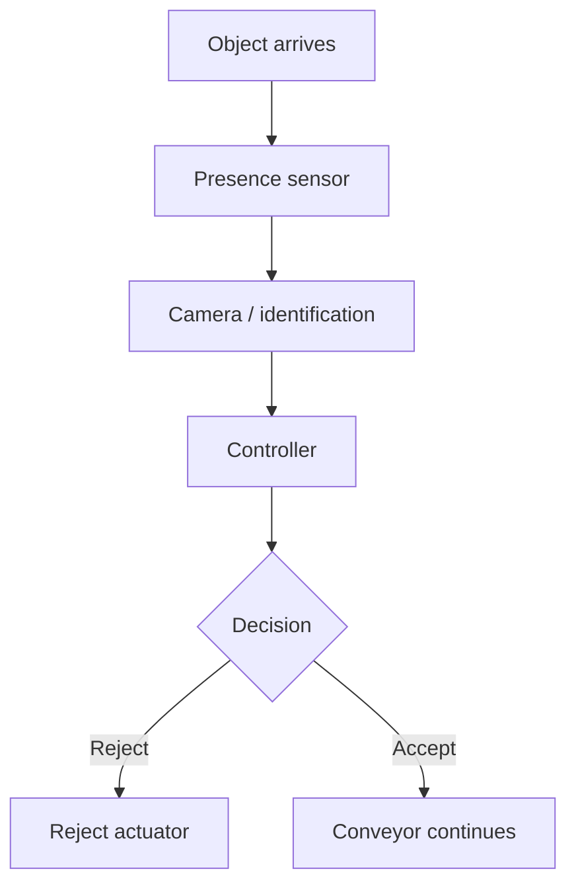

That diagram looks simple. Now multiply it: a real sorting line might make that decision **dozens of times per second**, for objects arriving at unpredictable intervals, cross-referencing a camera image against a database, while simultaneously tracking the position of every other object already on the belt. No human sorter, however skilled, can hold that many simultaneous, fast-changing variables in working memory and act on all of them correctly, every time.

> Automation becomes increasingly valuable — eventually indispensable — as the number of variables, decisions, and interactions in a process grows past what a human can reliably track at once. Past that point, it isn't a productivity choice anymore. It's the only way the process can run correctly at all.

---

## 11. Human + Machine, Not Human vs. Machine

It would be easy, after ten sections about human limitations, to walk away thinking this chapter is an argument for removing people from industry. It is the opposite. Read the two columns below slowly — this is the actual shape of a well-designed automated system.

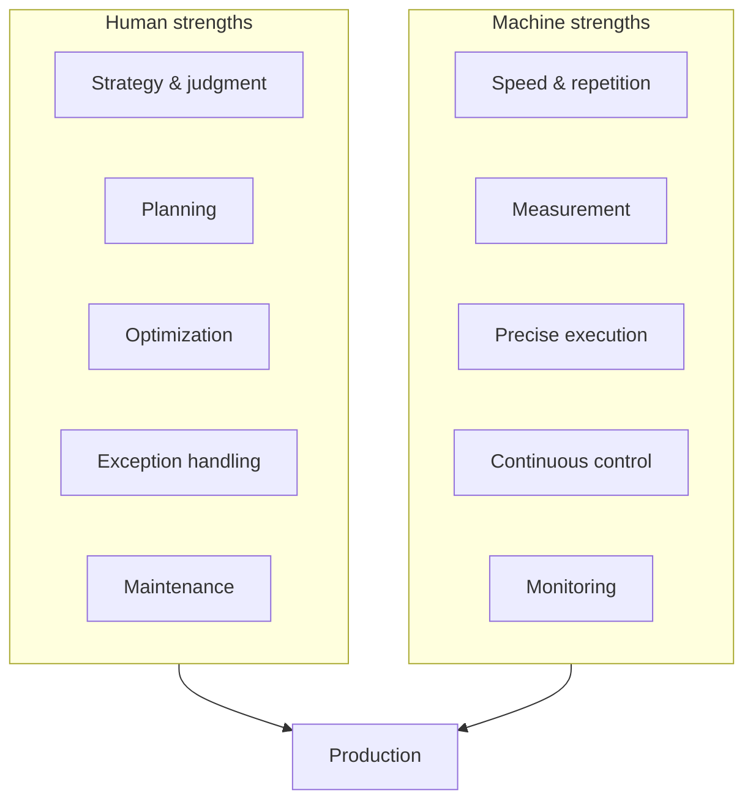

Look at what's in the human column: **judgment, planning, optimization, handling the unexpected, maintenance.** Every one of those is something no automated system does well on its own — a PLC has no judgment about *why* a process is behaving strangely, no ability to notice an emerging problem nobody programmed it to look for, no capacity to decide that today's priorities should change.

And look at the machine column: **speed, measurement, precise execution, continuous control, monitoring.** Every one of those is something the human body was never built to sustain indefinitely.

Automation doesn't out-compete people. It takes on the narrow, repetitive, continuous, high-speed slice of the work that human physiology was never suited for in the first place — freeing the humans in the system to do the parts that genuinely require a mind: noticing that something is subtly wrong, deciding what to prioritize, improving the process itself. **The goal was never to remove the human from the factory. It was to remove the human from the part of the loop that was quietly grinding them down.**

---

## 12. The Economics of Automation

None of the previous eleven sections happen for free. Automation exists because it solves real problems — but it also costs real money, and that trade-off deserves an honest look, not a sales pitch.

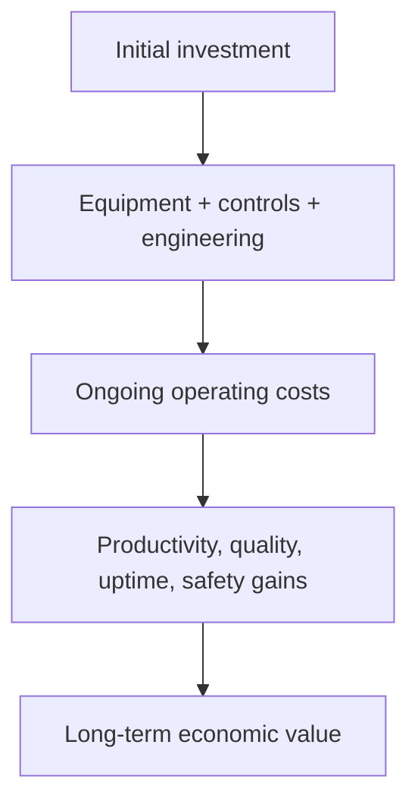

The trade-off, honestly stated: an automated system typically costs significantly more upfront than a manual station — equipment, controls hardware, engineering labor, commissioning, and training. That cost is only worth paying if the *accumulated* value — from higher output, tighter quality, less downtime, and fewer incidents — eventually exceeds it.

*(The chart below is illustrative to show the shape of the trade-off, not real measured data. Actual payback periods vary enormously by industry, process, and scale.)*

| Factor | Manual Line (illustrative) | Automated Line (illustrative) |
|---|---|---|
| Upfront cost | Low | High |
| Cost per unit at low volume | Competitive | Often not justified |
| Cost per unit at high volume | Rises with labor | Falls with scale |
| Quality variation | Higher | Lower |
| Time to break even | — | Depends entirely on volume and process |

This is why automation shows up first, and most heavily, in high-volume, high-consistency, high-risk processes — and shows up far more selectively in low-volume, highly variable, or judgment-heavy ones. That's not a limitation of automation technology. It's the economics doing exactly what they should.

---

## 13. Why Not Automate Everything?

If automation solves this many real problems, a fair question follows immediately: **why isn't everything fully automated already?**

The honest answer is a list of real constraints, not excuses:

- **Capital cost** — the upfront investment has to be justified by the payback.
- **Engineering complexity** — some processes are extraordinarily hard to sense, model, and control reliably.
- **Maintenance burden** — every automated system is now something that itself needs to be maintained, calibrated, and eventually replaced.
- **Downtime risk** — a failure in a highly automated line can halt the *entire* process, not just one station.
- **Process variability** — highly variable, low-repeatability processes (custom fabrication, artisanal work) don't reward automation the way repetitive ones do.
- **Low production volume** — if you're making twelve units, not twelve thousand, the economics rarely justify it.
- **Human judgment** — some decisions genuinely need contextual, adaptive human reasoning that current systems can't replicate.
- **Flexibility needs** — a manual station can be reconfigured in an afternoon; a hard-automated line may take weeks.
- **System integration difficulty** — bolting a new automated cell onto decades-old existing infrastructure is often harder than building from scratch.
- **Cybersecurity exposure** — every networked controller is also a new attack surface that must be secured.
- **Return on investment** — at the end of every one of these bullet points sits the same question: does this pay for itself?

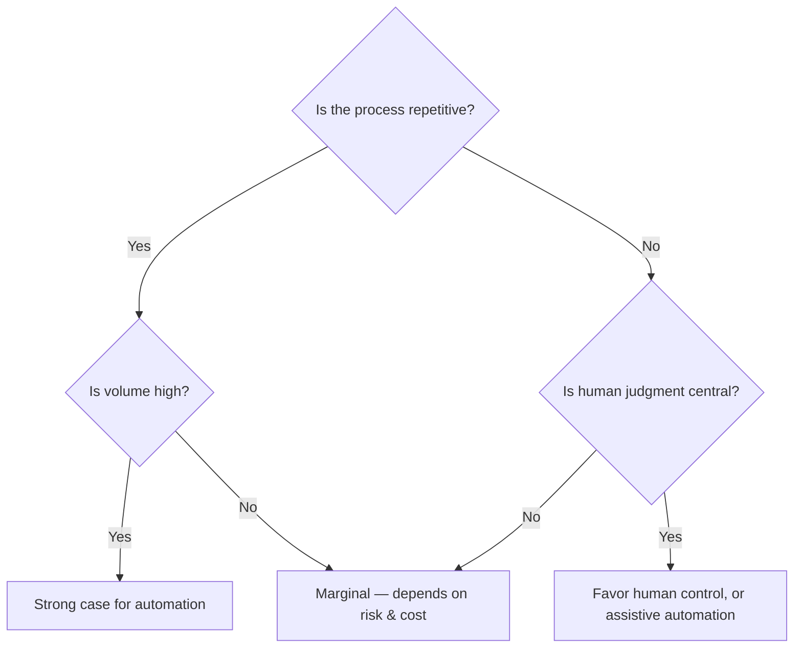

A mature engineer doesn't ask "can this be automated?" — almost anything can be, with enough budget. They ask **"should this be automated, given the volume, the variability, the risk, and the cost of getting it wrong?"** That question, asked honestly, is what keeps automation from becoming a solution in search of a problem.

---

## 14. The Real Engineering Answer

Pull everything above into one place, and a structure emerges.

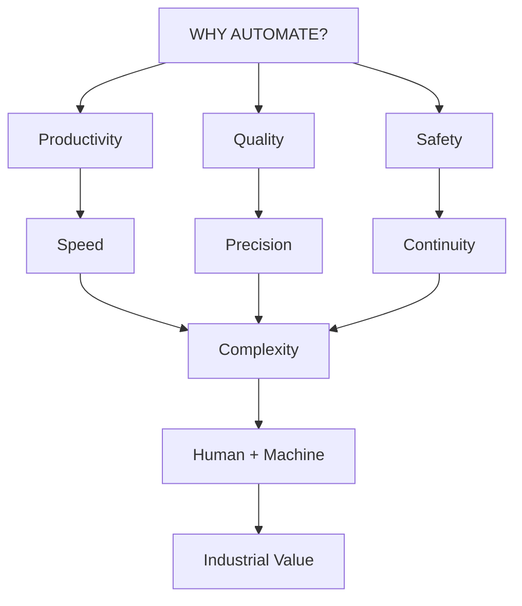

Every individual reason in this chapter — productivity, consistency, precision, speed, safety, continuity — is really a specific symptom of one root cause: **industrial processes generate more variables, faster, at higher stakes, than a human nervous system can track and act on alone.** Automation is the engineering answer to that root cause, applied wherever the economics justify it.

---

## 15. The First-Principles Explanation

Here is the deepest version of the answer — the one this entire repository is quietly built around.


> **Automation is, fundamentally, the engineering of a continuous information-and-action loop wrapped around a physical process.**

That is a meaningfully deeper claim than "automation means using machines instead of people." A water wheel is a machine. It isn't automation, because it doesn't *measure* anything and doesn't *decide* anything — it just responds to whatever water happens to arrive. The moment a system starts **measuring reality, turning that measurement into information, using that information to decide, and then acting on the physical world based on that decision** — that is the exact moment a machine becomes automation, no matter how mechanically simple or software-sophisticated it is. Watt's governor from Chapter 02 qualifies. A modern AI-driven predictive maintenance platform qualifies. They're the same loop, at wildly different scales of sophistication.

---

## 16. One Complete Example — Automatic Tank-Level Control

Let's make all of this concrete with the single clearest example in industrial automation: keeping a tank at a target water level, automatically.

```
┌────────────────┐
│      Tank       │
│                 │
Water ─────────→ │
│        ▲        │
│        │        │
└────────┼────────┘
         │
   Level Sensor
         │
         ▼
        PLC
         │
         ▼
   Control Valve
         │
         └───────→ Flow
```


Walk through what actually happens, step by step, the way the system experiences it:

1. **Tank level decreases** — water is being drawn out faster than it's coming in.
2. **The level sensor detects the drop** and reports a new measurement.
3. **The PLC receives that measurement** and compares it against the setpoint.
4. **The PLC calculates a control action** — how far to open the valve, and by how much.
5. **The valve opens** further, in direct response to that calculation.
6. **Flow into the tank increases.**
7. **Level begins rising** back toward the setpoint.
8. **As the level approaches target, the controller reduces the valve opening** — closing the loop smoothly instead of overshooting.

This is the single best illustration in the entire chapter of *why* automation exists, because it isn't showing off equipment — it's showing the exact loop from Section 15 (measure → decide → act → observe → correct) doing real, physical, useful work, with no person needing to stand at that tank, watching a sight-glass, all day.

---

## 17. From One Sensor to an Entire Enterprise

The tank example above is one loop, on one machine. Real industrial value comes from the same idea, scaled up, layer by layer:

.jpg)
*An entire factory complex — thousands of individual sensor-controller-actuator loops like the tank example, running simultaneously and reporting upward into one enterprise view. (Source: [Wikimedia Commons](https://commons.wikimedia.org/wiki/File:Ford_Dearborn_Factory_Aerial_(45574999515).jpg))*

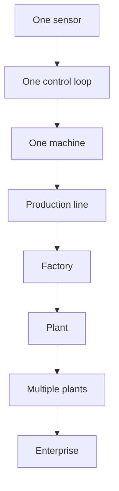

And structurally, that scaling maps directly onto the layered industrial architecture used throughout the rest of this repository:

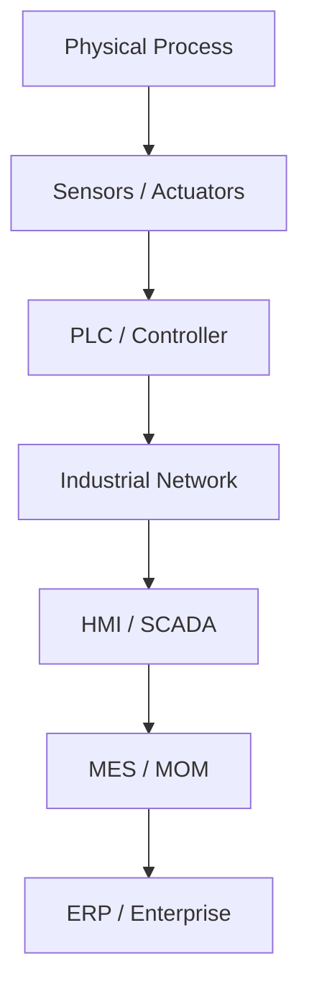

Every layer in that stack is still, underneath, the same measure-decide-act loop from Section 15 — just operating at a different scope, a different timescale, and a different level of the business. A control loop measures a valve in milliseconds. An ERP system "measures" plant performance in days or weeks. Same structure. Different zoom level.

---

## 18. The Final Question

> If automation exists to overcome human limitations, what exactly does an automated system need to **know**, **decide**, and **control**?

Sit with that question — it's not rhetorical. It's the actual on-ramp into the rest of this repository. To answer it, you need to understand, in order:

```
Sensors → Measurement → Control → Actuation → PLCs
```

That is precisely where Chapter 04 picks up.

---

## 19. Chapter Summary

You should now understand:

- **Why** industries automate — not as a slogan, but as an engineering response to real physical constraints.
- The specific, honest **limitations of human beings** as industrial control systems — not a character flaw, a biological fact.
- **Productivity** — machines don't need rest cycles the way human bodies do.
- **Repeatability** — automation doesn't drift in technique over a shift.
- **Precision** — closed-loop control achieves accuracy no human hand can match unassisted.
- **Speed** — electrical signal propagation beats human reaction time by orders of magnitude.
- **Safety** — automation isolates people from danger and reacts faster than a person can.
- **Continuity** — some processes genuinely cannot pause for a shift change.
- **Complexity** — past a certain point, no human can track every variable at once; automation isn't optional anymore.
- **Economics** — automation is a real trade-off, not a free upgrade.
- **Human-machine collaboration** — the goal was never removing people, only removing people from the part of the loop their physiology was never built to sustain.
- Why **complete automation isn't always optimal** — cost, complexity, and judgment set real limits.
- The one loop underneath all of it: **Measure → Decide → Act → Feedback.**

---

## 20. References

- ISA (International Society of Automation) — foundational control theory and terminology.
- IEC 61508 / IEC 61511 — functional safety and safety instrumented systems standards (referenced conceptually; consult the standards directly for compliance work).
- Human factors and ergonomics literature — human reaction time and sustained-attention research.
- Wikimedia Commons — photographs credited individually above each image.

---

**Previous:** [02 — where did industrial automation begin history](02-where-did-industrial-automation-begin-history-2.md)  

**Next:** [04 — Industrial Processes and Systems](04-industrial-processes-and-systems.md)

