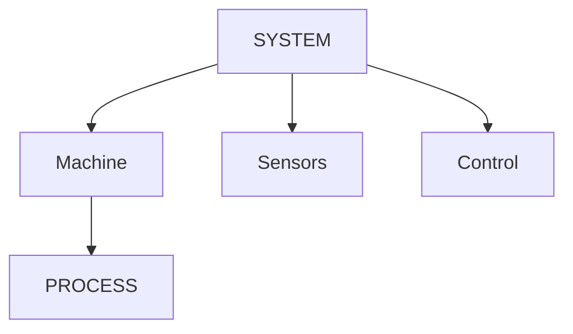
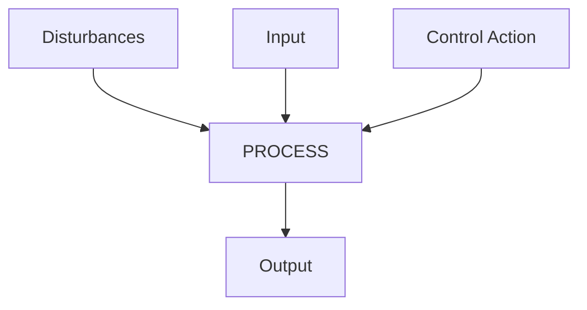
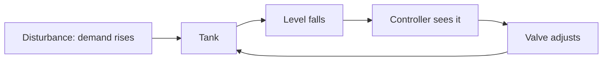
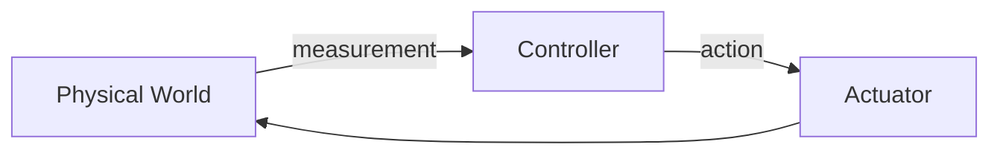
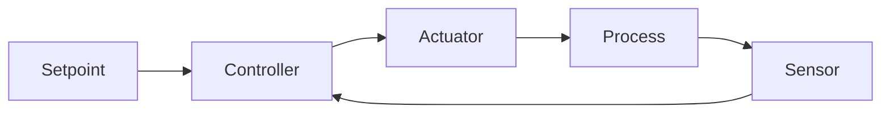
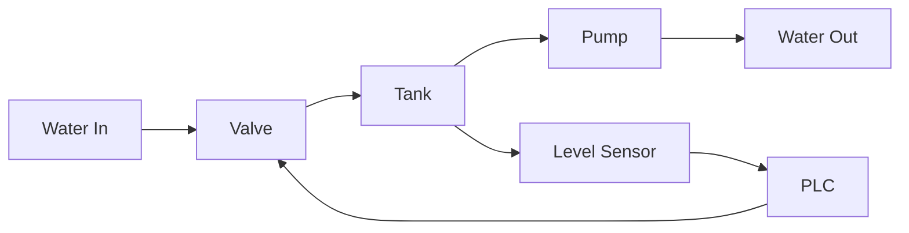
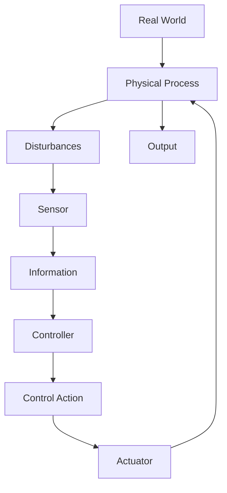

# Industrial Processes and Systems

[📄👾 Open Interactive Article 04](https://qurvon.github.io/Industrial-Automation-from-First-Principles/01-fundamentals/04-industrial-processes-and-systems-2.html)

> Before learning sensors, PLCs, control logic, or networks — understand the physical process those technologies are trying to control.

Every chapter before this one answered a question about automation itself: what it is, where it came from, why it exists. This chapter steps back and asks something more basic, and easy to skip past without ever really answering:

> **What exactly is happening inside a factory before automation enters the picture at all?**

If you can't answer that clearly, every sensor, controller, and network you learn about later will feel like abstract machinery with nothing underneath it. This chapter is the ground floor.

---

## Table of Contents

1. [What Is an Industrial Process?](#1-what-is-an-industrial-process)
2. [Process vs. Machine vs. System](#2-process-vs-machine-vs-system)
3. [Every Industrial Process Has a Purpose](#3-every-industrial-process-has-a-purpose)
4. [The Universal Structure of an Industrial Process](#4-the-universal-structure-of-an-industrial-process)
5. [Inputs — What Enters the Process?](#5-inputs--what-enters-the-process)
6. [Outputs — What Leaves the Process?](#6-outputs--what-leaves-the-process)
7. [Physical Variables](#7-physical-variables)
8. [The State of a Process](#8-the-state-of-a-process)
9. [Controlled Variable, Manipulated Variable, Disturbance](#9-controlled-variable-manipulated-variable-disturbance)
10. [Disturbances, in Depth](#10-disturbances-in-depth)
11. [Measurement — A Window Into the Process](#11-measurement--a-window-into-the-process)
12. [Actuation — How the System Changes Reality](#12-actuation--how-the-system-changes-reality)
13. [Open-Loop Control](#13-open-loop-control)
14. [Closed-Loop Control](#14-closed-loop-control)
15. [Types of Industrial Processes](#15-types-of-industrial-processes)
16. [Unit Operation → Machine → Line → Plant](#16-unit-operation--machine--line--plant)
17. [Systems Are Made of Interacting Subsystems](#17-systems-are-made-of-interacting-subsystems)
18. [System Boundaries](#18-system-boundaries)
19. [Interaction Between Systems](#19-interaction-between-systems)
20. [Complete Example — The Water Tank System](#20-complete-example--the-water-tank-system)
21. [The Complete First-Principles Model](#21-the-complete-first-principles-model)
22. [What Have We Actually Learned?](#22-what-have-we-actually-learned)
23. [References](#23-references)

---

## 1. What Is an Industrial Process?

Strip away every sensor, screen, and controller, and a factory is still doing exactly one thing: **taking something in one physical state and turning it into something in a different, more useful state.**


*Iron ore and coke go in; steel comes out. No PLC, sensor, or network changes that basic transformation — they only make it faster, safer, and more consistent. (Source: [Wikimedia Commons](https://commons.wikimedia.org/wiki/File:Steel_mill_in_Lorain.jpg))*

```
Raw Material → Physical Process → Transformation → Product
```

That's it. That's an industrial process, in its most stripped-down form — ore becomes steel, flour becomes bread, crude oil becomes fuel, raw water becomes drinking water. Automation doesn't replace this transformation. It sits *around* it, watching and steering it.

---

## 2. Process vs. Machine vs. System

These three words get used interchangeably in casual conversation, and that habit quietly causes confusion in every later chapter of this repository.

| Term | Definition | Example |
|---|---|---|
| **Process** | The physical transformation or operation taking place | Heating water |
| **Machine** | The equipment performing the operation | An industrial heater |
| **System** | The collection of interacting components that together achieve a purpose | Tank + heater + sensor + valve + controller + pump + pipes |



Here's why this distinction earns its own section: **a machine can exist without a system, and a process can exist without either.** A hand-cranked water pump performs a *process* (moving water) using a *machine* (the pump) with no *system* around it at all — no sensor, no controller, nothing measuring or deciding anything. The moment you add a level sensor and a controller that opens or closes a valve based on what that sensor reads, you now have a *system*.

---

## 3. Every Industrial Process Has a Purpose

Before any of the variables, sensors, or control logic covered later matter at all, ask the simplest possible question: **what is this process actually trying to accomplish?**

| Purpose | Typical machine |
|---|---|
| Heat something | Boiler |
| Move something | Conveyor |
| Mix materials | Tank / mixer |
| Separate materials | Filter |
| Press or form material | Press |
| Cut material | Saw / laser / shear |
| Transport material | Pump / conveyor |
| Generate electricity | Turbine / generator |
| Maintain pressure, level, or temperature | Control loop around any of the above |

This matters because **the purpose of a process determines everything downstream of it** — which variables need watching, what kind of sensor is appropriate, what "success" even means.

---

## 4. The Universal Structure of an Industrial Process

Almost every industrial process, regardless of industry, reduces to one shape.

**The simple version:**
```
INPUT → PROCESS → OUTPUT
```

**The real version** — the one that everything else in this chapter, and this repository, builds on:



Five ideas live inside that one diagram:

- **Inputs** — material, energy, or information entering the process.
- **Outputs** — product, waste, or information leaving it.
- **Disturbances** — unplanned changes that affect the process from outside anyone's control.
- **Control actions** — deliberate adjustments made to keep the process on target.
- **Measurements** — the information that makes control actions possible in the first place.

This single diagram is the foundation for everything in control engineering. Every PLC program, every control loop, every SCADA screen you'll encounter later in this repository is, underneath, an implementation of this shape.

---

## 5. Inputs — What Enters the Process?

Inputs are not only electrical signals. They fall into three genuinely different categories:

| Category | Examples |
|---|---|
| **Material** | Water, raw material, fuel, chemicals, parts |
| **Energy** | Electrical, mechanical, thermal, compressed air, hydraulic |
| **Information** | Production command, setpoint, recipe, operator command |

Notice that "information" belongs on this list at all — a setpoint entered by an operator is just as much an input to the process as the raw water flowing into a tank.

---

## 6. Outputs — What Leaves the Process?

Symmetrically, a process can produce:

- **Product** — the intended result.
- **Waste** — unintended but unavoidable byproduct.
- **Heat, motion, pressure, or flow** — physical outputs, sometimes intended, sometimes not.
- **Electrical energy** — the direct output of a power generation process.
- **Information** — a measurement, a status, a completion signal.

> An output can be physical or informational — and a well-designed system treats the informational outputs (measurements, statuses, alarms) as just as essential as the physical ones.

---

## 7. Physical Variables

This is where the chapter starts pointing directly at what automation engineers actually spend their time observing and manipulating.


*A pressure gauge — one physical variable, made visible. Every variable in the table below eventually has to become a number a controller can read, the same way this dial makes it a number a person can read. (Source: [Wikimedia Commons](https://commons.wikimedia.org/wiki/File:MAXIMATOR-High-Pressure-Manometer-01a.jpg), CC BY-SA 3.0)*

| Category | Core Variables |
|---|---|
| Thermal | Temperature |
| Mechanical | Speed, position, force, torque, weight, vibration |
| Fluid | Pressure, flow, level |
| Electrical | Voltage, current |
| Chemical | pH |

Every one of these variables is something that must eventually be turned into an electrical signal a controller can read — which is exactly the subject of Chapter 05.

---

## 8. The State of a Process

A process has a **state** — a complete snapshot of every relevant variable at one moment in time.

Take a tank, at one specific instant:

| Variable | Value |
|---|---|
| Level | 70% |
| Temperature | 65 °C |
| Pressure | 2 bar |
| Flow | 20 L/min |

```
Level changes → Sensor value changes → Process state changes
```

> **Automation doesn't control a "tank." It controls a state, continuously, as that state tries to drift away from where it should be.**

---

## 9. Controlled Variable, Manipulated Variable, Disturbance

| Term | Definition | Tank Example |
|---|---|---|
| **Controlled Variable (CV)** | What you want to control | Tank level = 70% |
| **Manipulated Variable (MV)** | What the controller actually changes | Valve opening = 45% |
| **Disturbance** | Something that changes the process without being the intended control action | A sudden increase in outlet flow |


*This is what a manipulated variable looks like in the real world — the one thing the controller is actually allowed to touch. (Source: [Wikimedia Commons](https://commons.wikimedia.org/wiki/File:Electric_valve_actuator.jpg))*

Notice the asymmetry: the controller never touches the controlled variable directly. It can only adjust the manipulated variable — the valve — and *hope*, based on a correct understanding of the process, that adjusting it produces the desired change in level.

---

## 10. Disturbances, in Depth

A disturbance deserves its own section because it's the concept most beginner explanations skip past — and it's the actual reason feedback control exists at all.



> A good control system doesn't merely produce an output. It responds when the real world changes unexpectedly.

Walk through the sequence: the tank is at setpoint → outlet demand suddenly increases → level begins decreasing → the sensor detects the change → the controller compares the new reading against the setpoint and calculates a correction → the valve adjusts, opening further → level returns toward target. Nobody told the controller demand was going to increase. It only needed to notice the effect and correct for it.

---

## 11. Measurement — A Window Into the Process

> The controller cannot directly "see" the physical world. It needs measurements.

```
Physical variable → Sensor → Electrical signal → Input system → Controller
```

A PLC has no eyes, no hands, no sense of temperature. Everything it "knows" about the physical world arrives exclusively through this chain. If that chain breaks anywhere — a failed sensor, a damaged cable, a miscalibrated signal — the controller isn't just "confused." It's making decisions based on a physical world that no longer matches reality.

---

## 12. Actuation — How the System Changes Reality

Now reverse the path. Measurement is how the system *perceives* reality; actuation is how it *changes* reality.

```
Controller → Output signal → Drive / valve / actuator → Physical action → Process changes
```

Common actuators: motors, valves, heaters, cylinders, solenoids, drives.



This is quietly one of the most important ideas in this entire repository. Every chapter from here forward is really just adding detail to one side of this loop — more detail on measurement (Chapter 05), or more detail on actuation and control logic (Chapters 06–07).

---

## 13. Open-Loop Control

```
Command → Controller → Actuator → Process
```

Notice what's missing: no arrow leads back from the process to the controller. **No feedback.**

> Example: a heater is switched ON for 10 minutes, regardless of the actual temperature reached.

This works right up until conditions change from whatever they were when the timing was calculated. Open-loop control isn't "wrong" — it's the correct, simplest choice for plenty of real tasks, but only when the relationship between command and outcome is reliable and unaffected by disturbances.

---

## 14. Closed-Loop Control



The difference from open-loop control is exactly one arrow — the path from process, through a sensor, back to the controller. That single arrow is the entire concept of feedback: the controller now knows what actually happened, not just what it commanded to happen.

Walk the sequence: setpoint is set → process changes → sensor measures the result → controller compares that result to the setpoint → controller reacts → process is corrected → sensor measures again. This loop never stops running. It is, without exaggeration, the single most important structural idea in all of industrial automation.

---

## 15. Types of Industrial Processes

Four broad categories cover almost everything you'll encounter.

### A. Continuous processes
Material flows in and product flows out, essentially without interruption.
```
Material →→→ Process →→→ Product
```
Examples: oil refining, chemical plants, water treatment, power generation.

### B. Batch processes
A defined quantity is processed as a discrete "batch," start to finish, before the next one begins.


*Mixing 1,000 L of a chemical to a fixed recipe — load, process, hold, unload, then start the next batch. (Source: [Wikimedia Commons](https://commons.wikimedia.org/wiki/File:Industrial_planetary_mixer.jpg))*

```
Load → Process → Hold → Unload
```

### C. Discrete processes
Individual, countable units move through distinct stages.
```
Part → Assembly → Inspection → Packaging
```
Example: an assembly line, where each unit is a separate, trackable item.

### D. Hybrid processes
Most real plants combine all three — a continuous upstream process feeding a batch mixing stage, followed by discrete packaging.

| Type | Example |
|---|---|
| Continuous | Refinery, water treatment plant |
| Batch | Chemical mixing to a recipe |
| Discrete | Assembly line, packaging line |
| Hybrid | Most real-world plants |

---

## 16. Unit Operation → Machine → Line → Plant

```
Physical phenomenon → Unit operation → Machine → Production cell → Production line → Plant → Enterprise
```

A **unit operation** is the smallest meaningful physical step — heating, mixing, filtering. A **machine** physically performs one or more unit operations. A **production cell** groups machines that work together. A **production line** strings cells together. A **plant** houses multiple lines. An **enterprise** may operate multiple plants. A fault at the unit-operation level (one clogged filter) can, left unaddressed, eventually show up as a missed shipment at the enterprise level.

---

## 17. Systems Are Made of Interacting Subsystems

Take a pumping system:

| Subsystem | Components |
|---|---|
| Measurement | Pressure sensor, flow sensor, level sensor |
| Control | PLC |
| Actuation | Motor, pump |

> Failure or change in one subsystem can affect the entire system.

A pressure sensor drifting out of calibration doesn't just produce a wrong number on a screen — it can cause the controller to make a wrong decision, which moves an actuator incorrectly, which changes the actual physical process.

---

## 18. System Boundaries

**Where does a system begin, and where does it end?**

```
System boundary: [ Tank → Pump → Valve → Sensors + Controller ]
Water flows in from outside the boundary; process output leaves across it.
```

The boundary is a choice, not a physical fact:

- A pump can be **inside** the "pumping system" boundary.
- The same pump is **outside** the boundary of the "tank level control system," if that system is defined more narrowly.
- The same pump can be a **subsystem** of a larger "plant water system."

This isn't pedantic — it's essential for real engineering analysis. Troubleshooting, documentation, and responsibility all depend on everyone agreeing where one system's boundary ends and the next one's begins.

---

## 19. Interaction Between Systems

```
System A → Interface → System B → Interface → System C
```

A concrete industrial version of that same chain:

```
Machine → PLC → Industrial Network → SCADA → MES
```

Each arrow is an interface — a defined, agreed-upon way for one system to hand information (or material, or energy) to the next.

---

## 20. Complete Example — The Water Tank System

Every concept in this chapter, tied together in one deliberately simple case study.


*Real water treatment infrastructure — underneath the scale and complexity, the same tank-and-valve loop below is doing the core work. (Source: [Wikimedia Commons](https://commons.wikimedia.org/wiki/File:Waste_Water_Treatment_Plant.jpg), CC BY-SA 4.0)*



Now map every term from this entire chapter onto this one system:

| Element | Role |
|---|---|
| Water | Process material |
| Tank | Process |
| Level | Controlled variable |
| Valve | Manipulated element |
| Sensor | Measurement |
| PLC | Controller |
| Outlet demand | Disturbance |
| Water out | Process output |

If every row of that table makes sense to you without re-reading an earlier section, this chapter has done its job.

---

## 21. The Complete First-Principles Model

Everything in this chapter compresses into one diagram.



> Industrial automation is built around the interaction between a physical process, measurements, decisions, and physical actions.

That sentence is the entire chapter, said once, plainly.

---

## 22. What Have We Actually Learned?

- What is a process? What is a system? What's the difference between a machine and a process?
- What are inputs and outputs — and why does "information" count as both?
- What are physical variables, and how are they grouped?
- What is the *state* of a process?
- What is a controlled variable? A manipulated variable? A disturbance?
- Why is measurement necessary — what can't a controller do without it?
- How does an actuator turn a decision into a physical change?
- What is open-loop control, and when does it fail?
- What is closed-loop control, and why does that one feedback arrow matter so much?
- What separates continuous, batch, and discrete processes?
- What is a subsystem? A system boundary? How do systems interact through interfaces?

```
Sensors → Measurement → Control → Actuation → PLCs
```

Chapter 05 picks up exactly where Section 11 of this chapter left off: **how do you actually turn a physical variable into a signal a controller can trust?**

---

## 23. References

- ISA (International Society of Automation) — process control terminology and standards.
- IEC 61512 / ISA-88 — batch control standards (referenced conceptually).
- Perry's Chemical Engineers' Handbook — unit operations framework.
- Wikimedia Commons — photographs credited individually above each image.

---

**Previous:** [03 — Why Industrial Automation Exists](03-why-industrial-automation-exists.md)

**Next:** [05 — Measurement and Instrumentation Fundamentals](05-measurement-and-instrumentation-fundamentals.md)

