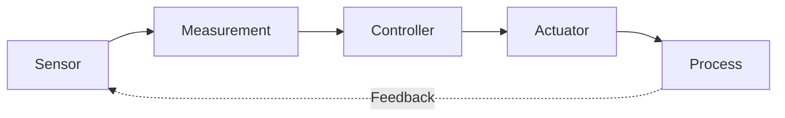
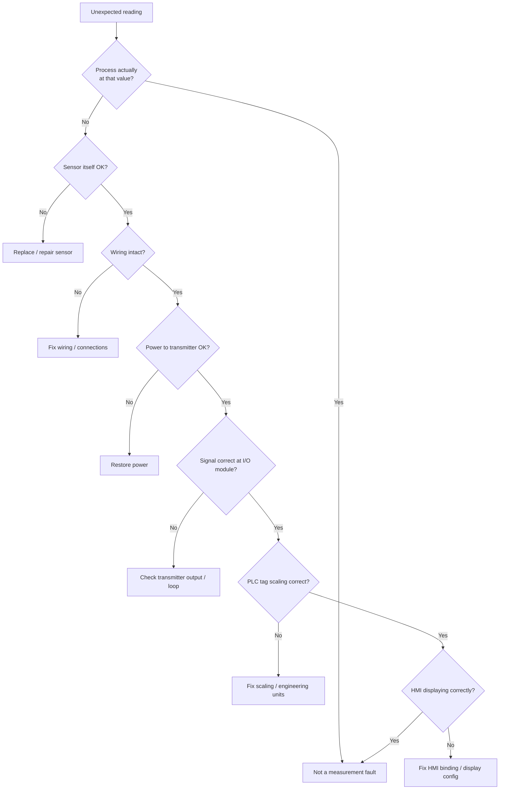

# 05 — Measurement and Instrumentation Fundamentals

[📄👾 Open Interactive Article 05](https://qurvon.github.io/Industrial-Automation-from-First-Principles/01-fundamentals/05-measurement-and-instrumentation-fundamentals-2.html)

> **Measure the physical world. Understand the signal. Trust the information.**

---

## Why This Chapter Exists ?

Automation cannot control what it cannot measure. Every control decision a PLC makes — opening a valve, starting a motor, tripping an alarm — is only as good as the measurement that fed it. This chapter builds the bridge between **physical reality** and the **digital information** a control system acts on.

A physical quantity is not automatically "data." It becomes trustworthy information only after it passes through a chain of sensing, conversion, conditioning, transmission, and interpretation — and at every step, something can go wrong. Understanding that chain, and where it can fail, is the real subject of this chapter.

By the end of this chapter you should be able to answer:

- What does it actually mean to *measure* something?
- How does a physical phenomenon become an electrical signal, and then a number in a PLC?
- Why do industrial signals look the way they do (4–20 mA, 0–10 V, HART, discrete)?
- How do you judge whether a measurement can be trusted?
- How do you trace a measurement problem back to its root cause?


*Figure 1 — From physical process to decision: sensor → signal conditioning → transmitter → PLC I/O → controller → HMI/SCADA.*

This chapter connects directly to [04 — Industrial Processes and Systems](../04-industrial-processes-and-systems.md) (the *what* being measured) and sets up [06 — Actuators and Final Control Elements](../06-actuators-and-final-control-elements.md) and the upcoming PLC chapters (the *what happens next*).

---

## 1. What Is Measurement?

Measurement is not simply "reading a sensor." It is the process of comparing a physical quantity against a reference or standard to produce a **value with an associated uncertainty**. NIST defines measurement as a process that produces an estimate of a quantity together with the uncertainty of that estimate — the number alone is not the whole story.

Key vocabulary:

| Term | Meaning |
|---|---|
| **Measurand** | The specific quantity intended to be measured (e.g., "temperature of the fluid at the tank outlet") |
| **Reference / standard** | A known, traceable quantity used for comparison |
| **Measurement result** | The value obtained from the measurement process |
| **Measurement uncertainty** | The doubt that exists about the result — how far it might be from the true value |
| **Indication** | What the instrument displays or outputs — not necessarily the true physical quantity |

```
Physical phenomenon
        ↓
     Measurand
        ↓
 Measurement process
        ↓
   Measured value
        ↓
    Uncertainty
        ↓
      Decision
```

The reader should internalize this before touching a single sensor: **every measurement is an estimate, not a fact.** Good instrumentation design is about keeping that estimate close enough to reality for the decision that depends on it.

---

## 2. Why Industrial Automation Needs Measurement

Ask the practical question: *why can't a PLC simply control a machine without measurement?*

```
No measurement
      ↓
No knowledge of process state
      ↓
No reliable feedback
      ↓
No meaningful control
```

**Manual process:**
`Human observes → Human decides → Human acts`

**Automated process:**



Take away the measurement, and the feedback loop is broken — the controller is acting blind. This is the single most important idea in this chapter: **control quality has a hard ceiling set by measurement quality.** No control algorithm, however advanced, can compensate for a measurement that doesn't reflect reality.

---

## 3. What Exactly Are We Measuring?

Industrial systems measure a recurring set of physical quantities:

| Domain | Typical Units |
|---|---|
| Temperature | °C, °F, K |
| Pressure | Pa, bar, psi |
| Flow | L/min, m³/h |
| Level | mm, %, m |
| Position | mm, degrees |
| Speed | rpm, m/s |
| Force | N |
| Torque | N·m |
| Weight / Mass | kg |
| Electrical | V, A, Ω, W |
| Vibration | mm/s, acceleration (g) |
| Chemical | pH, conductivity, concentration |


*Figure 2 — A typical process area rarely relies on a single measurement type; temperature, pressure, level, and flow instruments usually coexist on the same skid.*

---

## 4. The Measurement System — The Complete Chain

This is the backbone diagram of the entire chapter. Every instrumentation topic that follows fits somewhere on this chain.


Keep this chain in mind as a mental checklist: whenever a number on an HMI looks wrong, it is wrong at *one specific link* in this chain — and finding which link is the core diagnostic skill of instrumentation work (see §22, "Diagnostic Thinking").

---

## 5. Sensor vs. Transducer vs. Transmitter vs. Instrument

These four words get used loosely in industry, but they mean distinct things:

- **Sensor** — detects and responds to a physical quantity (e.g., a thermocouple junction).
- **Transducer** — converts one form of energy or quantity into another usable form (often used interchangeably with "sensor," but strictly the *conversion* element).
- **Transmitter** — converts the measurement into a standardized signal suitable for transmission over distance (e.g., 4–20 mA, HART).
- **Instrument** — the broader device or system that indicates, records, or processes measurement information; may bundle sensor + transmitter in one housing.

```
Physical quantity
      ↓
   SENSOR
      ↓
 TRANSDUCER
      ↓
    SIGNAL
      ↓
 TRANSMITTER
      ↓
STANDARDIZED SIGNAL
      ↓
INSTRUMENT / PLC
```

> **Note:** real industrial products blur these lines constantly — a "pressure transmitter" is a sensor, transducer, and transmitter in a single package. The terminology matters for understanding *function*, not for memorizing rigid product categories.

---

## 6. From Physics to Electricity

This is where instrumentation becomes engineering. A physical change has to become an electrical change before a PLC can ever see it.

```
Temperature  → Resistance change   → Electrical signal
Pressure     → Diaphragm deflection → Electrical signal
Position     → Magnetic/optical/mechanical change → Electrical signal
```


*Figure 3 — Every sensing technology is, at its core, a translator between an energy domain and electricity.*

---

## 7. Analog vs. Digital Measurement

**Analog** signals vary continuously: 4–20 mA, 0–10 V, thermocouple millivolts, RTD resistance.

**Digital** signals represent discrete states or discrete data: proximity sensor ON/OFF, limit switch contacts, encoder pulses, fieldbus communication.

```
Analog:                         Digital:
     ╭────╮                     ──────┐    ┌──────┐
─────╯    ╰────╮                      └────┘      └────
               ╰────
```

### 7.1 Discrete Measurement

Discrete instrumentation answers yes/no questions:

- Object detected? YES / NO
- Valve open? YES / NO
- Motor running? YES / NO
- Limit reached? YES / NO

Common technologies: proximity sensors, photoelectric sensors, limit switches, pressure switches, float switches — typically wired into a **24 V DC → PLC digital input**.

### 7.2 Continuous Measurement

Continuous instrumentation reports a value across a range:

```
Temperature = 73.4 °C
Pressure    = 5.72 bar
Flow        = 124.6 L/min
Level       = 67.3 %
```

Continuous measurement is what enables process control, alarming, trending, optimization, and closed-loop control — anywhere a controller needs to know *how much*, not just *yes or no*.

---

## 8. Common Industrial Sensor Technologies

Each subsection below follows the same discipline: the underlying physics first, then the practical engineering behavior that follows from it. Knowing *why* a sensor behaves the way it does is what lets you predict failure modes before you see them in the field.

### 8.1 Temperature


*Figure 4 — An RTD probe: resistance increases predictably with temperature, giving one of the most stable and repeatable temperature measurements available.*

**RTD (Resistance Temperature Detector).** A pure metal (almost always platinum) has a resistance that increases in a predictable, highly repeatable way as temperature rises. Over a limited industrial range this is approximated by a linear relationship:

```
R(T) = R₀ · (1 + α·T)
```

Where `R₀` is the resistance at 0 °C (100 Ω for a Pt100, 1000 Ω for a Pt1000), and `α` is the temperature coefficient of resistance (≈ 0.00385 Ω/Ω/°C for standard Pt100 per IEC 60751). Over wider ranges, the more precise **Callendar–Van Dusen equation** is used, which adds quadratic (and, below 0 °C, cubic) correction terms — this is why quality temperature transmitters store polynomial coefficients rather than a single linear slope.

RTDs are *passive* — they require an excitation current to produce a measurable voltage drop, and that same current causes **self-heating error** if too large, which is why RTD excitation currents are deliberately kept small (typically ~1 mA or less).

**Thermocouple.** Two dissimilar metal wires joined at a "hot junction" generate a small voltage (the **Seebeck effect**) proportional to the temperature difference between that junction and a "cold" (reference) junction:

```
V = S · (T_hot − T_cold)
```

Where `S` is the Seebeck coefficient of the metal pair (e.g., ~41 µV/°C for Type K near room temperature — and non-linear over wide ranges, which is why transmitters apply a lookup table or polynomial, not a single constant). Because the output depends on a *difference*, thermocouples require **cold-junction compensation** — the transmitter measures its own terminal temperature (often with a small onboard sensor) and adds back the voltage that junction would itself produce, to recover the true hot-junction temperature. Skipping this step is one of the most common thermocouple wiring mistakes in the field.

**Thermistor.** A semiconductor whose resistance changes sharply — and non-linearly — with temperature, typically decreasing as temperature rises (NTC — negative temperature coefficient). Far more sensitive than an RTD over a narrow span, but usable range is much smaller and the response is strongly non-linear, requiring more aggressive linearization.

**Temperature transmitter.** Regardless of which sensing element is used upstream, the transmitter's job is the same: apply the correct linearization curve, perform cold-junction compensation if needed, and output a standardized signal (4–20 mA, HART, or a fieldbus value) in engineering units.

| Technology | Typical Range | Accuracy Class | Notes |
|---|---|---|---|
| RTD (Pt100) | −200 °C to 850 °C | Very high, very stable | Needs excitation; self-heating risk |
| Thermocouple | −200 °C to 1800+ °C (type dependent) | Moderate | Widest range, rugged, needs cold-junction compensation |
| Thermistor | −50 °C to 150 °C (typical) | High sensitivity, narrow range | Strongly non-linear |

### 8.2 Pressure


*Figure 5 — Pressure deflects a diaphragm; the sensing element converts that deflection into an electrical signal.*

```
Pressure
   ↓
Diaphragm deformation
   ↓
Sensing element (strain gauge / capacitive / piezoresistive)
   ↓
Electrical signal
   ↓
Transmitter
```

A thin diaphragm deflects under applied pressure; the sensing element converts that mechanical deflection into an electrical change. Two dominant approaches:

- **Piezoresistive / strain-gauge based** — deflection strains a resistive element bonded to the diaphragm; resistance change is measured via a Wheatstone bridge (see §8.7).
- **Capacitive** — the diaphragm forms one plate of a capacitor; deflection changes the gap (and therefore the capacitance) between it and a fixed reference plate.

Three pressure references matter, and confusing them is a common specification error:

| Type | Reference | Typical Notation |
|---|---|---|
| **Gauge pressure** | Local atmospheric pressure | barg, psig |
| **Absolute pressure** | Perfect vacuum | bara, psia |
| **Differential pressure** | Second process pressure | ΔP |

Differential pressure deserves special attention because it is used **indirectly** to infer both flow (via the orifice/Bernoulli relationship, see §8.4) and level (via hydrostatic pressure, see §8.3) — a single DP transmitter technology underlies three different "measurement types" on a P&ID.

### 8.3 Level

Multiple physical principles compete for the same job, each with different strengths:

- **Float** — mechanical, simple, robust, but has moving parts that can stick or foul.
- **Ultrasonic** — non-contact; a sound pulse is emitted downward and level is inferred from the round-trip time: `d = (v_sound × t) / 2`. Affected by vapor, temperature gradients (which change `v_sound`), and foam.
- **Radar** — non-contact; a microwave pulse is timed the same way ultrasonic is, but at the speed of light: `d = (c × t) / 2`. Handles vapor, dust, and temperature gradients far better than ultrasonic because electromagnetic wave speed barely changes with those conditions.
- **Differential pressure** — infers level from hydrostatic pressure at the bottom of a vessel: `P = ρ · g · h`, so `h = P / (ρ · g)`. Critically **depends on the fluid density `ρ`** — a DP level transmitter calibrated for water will read wrong if the fluid's density changes (e.g., temperature-driven density shift, or a different product in the tank).
- **Capacitive** — the probe and vessel wall form a capacitor; capacitance changes as the higher-dielectric-constant liquid replaces air along the probe.


*Figure 6 — Non-contact radar level measurement: a microwave pulse is timed as it reflects off the liquid surface; the round-trip delay converts directly to distance, and distance converts to level once tank geometry is known.*

### 8.4 Flow


*Figure 7 — Different physical principles behave differently with viscosity, conductivity, and particulates.*

- **Differential pressure (orifice plate)** — a restriction in the pipe creates a measurable pressure drop related to flow rate by `Q ∝ √ΔP` (from the Bernoulli relationship) — note the **square-root relationship**, which means a DP flow transmitter has poor resolution at low flow and must often be signal-conditioned with a square-root extractor before scaling.
- **Electromagnetic** — applies Faraday's law of induction: a conductive fluid moving through a magnetic field induces a voltage proportional to velocity. Requires a conductive fluid; will not work on hydrocarbons, deionized water, or gases.
- **Vortex shedding** — a bluff body in the flow path sheds vortices at a frequency proportional to flow velocity (the Strouhal relationship); the meter counts shedding frequency rather than measuring a continuous analog value directly.
- **Coriolis** — the fluid is passed through a vibrating tube; the fluid's inertia causes a measurable phase shift (Coriolis effect) directly proportional to **mass** flow rate, not volumetric flow — this makes Coriolis meters uniquely able to report mass flow, density, and temperature from a single sensing element, at high accuracy, independent of fluid pressure/temperature compensation needed by other technologies.
- **Ultrasonic** — measures the transit-time difference of sound pulses sent with and against the flow direction; can be clamp-on (non-invasive) or inline (wetted, more accurate).

Each principle behaves differently with viscosity, conductivity, particulates, bubbles, and pipe orientation — the "right" flow meter is chosen from the fluid properties outward, not just from the flow range required.

### 8.5 Position and Proximity

| Technology | Target | Typical Use |
|---|---|---|
| Inductive | Metal only | Short-range detection, very rugged |
| Capacitive | Metal or non-metal | Detects most materials including liquids/granules |
| Photoelectric | Any (reflects/breaks light) | Longer range, sensitive to optical contamination |
| Magnetic (reed/Hall) | Magnet-equipped target | Cylinder position sensing |
| LVDT | Mechanical core, continuous | High-precision continuous linear position |
| Encoder (incremental/absolute) | Rotating shaft | Precise angular position/speed, feeds motion control |

An **incremental encoder** outputs pulses per revolution and requires a reference/home position to know absolute location; an **absolute encoder** outputs a unique code for every shaft position and knows its position immediately at power-up — an important distinction for machines that cannot tolerate a homing routine after every restart.

### 8.6 Speed

Speed measurement is fundamentally position measurement differentiated over time: pulses (from a proximity sensor or encoder) are counted over a known time window, or the time between pulses is measured directly (better for low speeds, where few pulses arrive per unit time). Tachometers and Hall-effect sensors follow the same underlying principle applied to rotating machinery.

### 8.7 Force and Torque


*Figure 8 — Four strain gauges in a bridge amplify sensitivity and cancel common-mode temperature drift.*

The workhorse technology is the **strain gauge**: a resistive element whose resistance changes proportionally to the mechanical strain applied to it:

```
ΔR/R = GF · ε
```

Where `GF` is the gauge factor (typically ≈ 2 for metallic foil gauges) and `ε` is strain (dimensionless, ΔL/L). Because this resistance change is tiny, strain gauges are almost never read individually — they are arranged in a **Wheatstone bridge** (commonly a full bridge, four active gauges) so that the small resistance imbalance produces a measurable differential voltage, and so that unwanted effects (like temperature-driven resistance drift, which affects all four gauges equally) cancel out. A **load cell** is simply a precisely machined metal body with strain gauges bonded to it in a bridge configuration; **torque sensors** apply the same principle to a shaft under twist.

### 8.8 Vibration

Three related quantities describe the same mechanical motion, and each is preferred for different fault types:

- **Displacement** — how far something moves; best for low-frequency, high-amplitude issues (e.g., shaft misalignment, looseness).
- **Velocity** — how fast it moves; the traditional standard for general rotating-machinery health monitoring (ISO 10816/20816).
- **Acceleration** — the rate of change of velocity; best for detecting high-frequency events like bearing defects and gear mesh problems.

An **accelerometer** (commonly piezoelectric) is the physical sensing element in almost all industrial vibration monitoring; velocity and displacement are typically derived mathematically (by integration) from the raw acceleration signal. This section is foundational for the condition-monitoring and predictive-maintenance material that comes later in this repository.

---

## 9. Sensor Classification

```
Industrial Sensors
│
├── Contact           vs   Non-contact
├── Analog             vs   Digital
├── Active             vs   Passive
├── Direct             vs   Indirect
└── Smart / Networked
```

### 9.1 Active vs. Passive Sensors

- **Active** — generates its own electrical output from the measured phenomenon (e.g., a thermocouple, or certain piezoelectric applications).
- **Passive** — requires external excitation and changes an electrical parameter in response (e.g., RTD, strain gauge, potentiometer).

> This terminology varies between textbooks and industries — always confirm the convention being used in a given context rather than assuming.

---

## 10. Sensor Characteristics

These properties determine whether a sensor is *fit for purpose*, independent of what it measures:

| Property | Meaning |
|---|---|
| Range | Minimum to maximum measurable value |
| Span | Difference between upper and lower range values |
| Sensitivity | Output change per unit input change |
| Resolution | Smallest detectable change in the measured quantity |
| Accuracy | Closeness of the result to the true value |
| Precision | Closeness of repeated results to each other |
| Repeatability | Agreement between successive measurements under identical conditions |
| Reproducibility | Agreement between measurements taken under different conditions |
| Linearity | How closely output tracks a straight-line relationship to input |
| Hysteresis | Difference in output depending on direction of change (rising vs. falling) |
| Dead band | Range of input change that produces no output change |
| Threshold | Minimum input required to produce a detectable output |
| Drift | Slow change in output over time under constant input |
| Response time | How quickly output follows a change in input |
| Stability | Ability to maintain performance over time and conditions |

### 10.1 Accuracy vs. Precision

```
High accuracy, high precision:   ● ● ●  (tight cluster, centered)
High accuracy, low precision:    ●   ●  ●  (scattered, but centered)
Low accuracy, high precision:    ●●●     (tight cluster, off-center)
Low accuracy, low precision:     ●  ●   ● (scattered, off-center)
```

*A sensor can be highly precise and still wrong — precision alone is not proof of correctness.*

### 10.2 Range, Span, and Resolution — Worked Example

```
Pressure transmitter:
Range = 0–10 bar
Lower Range Value (LRV) = 0 bar
Upper Range Value (URV) = 10 bar
Span = URV − LRV = 10 bar
```

Resolution depends on the analog-to-digital converter behind it. A 12-bit ADC has `2¹² = 4096` discrete steps across its full input span:

```
Resolution = Span / 2ⁿ = 10 bar / 4096 ≈ 0.00244 bar per step (≈ 2.44 mbar)
```

Doubling the ADC resolution to 16-bit (`2¹⁶ = 65,536` steps) improves this to `10 / 65536 ≈ 0.000153 bar per step` — a 16× improvement for 4 extra bits. This is why the transmitter's internal ADC resolution, not just the sensing element itself, sets a hard floor on how finely a measurement can be reported. Note also that **resolution is not accuracy** — a 16-bit ADC can resolve extremely fine steps while still being wildly inaccurate if the sensing element itself is poorly calibrated or drifting.

### 10.2.1 Accuracy Specification — Reading the Fine Print

Instrument accuracy is usually specified one of two ways, and confusing them leads to real specification errors:

- **% of span** — a fixed absolute error across the whole range. A ±0.1% of span error on a 0–10 bar transmitter is always ±0.01 bar, whether the reading is 1 bar or 9 bar.
- **% of reading** — the error scales with the actual value. A ±0.1% of reading error at 1 bar is ±0.001 bar, but at 9 bar it is ±0.009 bar.

A transmitter spec'd "% of span" will look proportionally worse at low readings near the bottom of its range — this is one reason instruments are usually selected so the normal operating point sits well above the bottom of the calibrated range, not right at it.

### 10.3 Sensitivity

*How much the output changes when the input changes.*

```
Temperature ↑ 1 °C
       ↓
Resistance ↑ 0.385 Ω     (typical Pt100 RTD)
```

### 10.4 Linearity

```
Ideal response:              Actual response:
     /                            _/
    /                            /
   /                           _/
  /
 /
```

Real sensors rarely follow a perfect mathematical relationship — this is why transmitters and PLCs often apply linearization or scaling.

### 10.5 Hysteresis

```
Output
  ↑
  │     /──── (decreasing input)
  │    /
  │───/  (increasing input)
  │
  └──────────→ Input
```

The same input value can produce two different outputs depending on whether the input was rising or falling into that value.

---

## 11. Response Time and Dynamic Measurement

```
Physical change → Sensor response → Signal conditioning → Transmission → PLC scan → Control action
```

Every one of those steps adds delay. A process that changes faster than the measurement chain can respond will always appear "smoothed" or lagged on the HMI — and a controller reacting to a lagged measurement can overshoot or oscillate.

### 11.1 Static vs. Dynamic Measurement

| | Static | Dynamic |
|---|---|---|
| Process behavior | Slowly changing | Rapidly changing |
| Priority | Accuracy | Response time |
| Example | Tank temperature | Motor vibration |
| Example | Tank level | High-speed position |

---

## 12. Signal Conditioning

Raw sensor output is frequently too small, too noisy, or too nonlinear to use directly. Signal conditioning bridges the gap.

```
Sensor → Tiny / noisy signal → Amplifier → Filter → Isolation → Standard signal
```

Common signal-conditioning functions: amplification, filtering, isolation, linearization, excitation (powering passive sensors like RTDs and strain gauges), bridge circuits, and analog-to-digital conversion.

---

## 13. Standard Industrial Signals

| Category | Examples |
|---|---|
| Voltage | 0–10 V, ±10 V, 1–5 V |
| Current | 4–20 mA |
| Discrete | 24 V DC |
| Digital communication | HART, Modbus, IO-Link, industrial Ethernet |

Protocol-level detail (Modbus registers, HART commands, Ethernet/IP, etc.) is deliberately deferred to a later networking chapter — here the goal is only to recognize *why* these signal types exist.

### 13.1 Why 4–20 mA Became the Industry Standard


*Figure 9 — The 4 mA live zero enables broken-wire detection that a 0 mA baseline never could.*

```
4 mA  → 0 % of range
12 mA → 50 % of range
20 mA → 100 % of range
```

```
4 mA                12 mA                 20 mA
 │────────────────────│────────────────────│
 0%                  50%                  100%
```

The signal deliberately starts at **4 mA instead of 0 mA**. This "live zero" gives several practical advantages:

- **Broken-wire detection** — if the loop reads 0 mA, that's a fault, not a valid "0%" reading.
- **Powering two-wire transmitters** — the loop current itself can power the field device.
- **Improved fault diagnosis** — out-of-range currents (below 4 mA or above 20 mA) clearly indicate a problem rather than an extreme process value.

### 13.2 Two-Wire, Three-Wire, and Four-Wire Instruments

```
2-wire:  Power + Signal (shared conductors)
3-wire:  Power / Common / Signal
4-wire:  Power pair + Signal pair (fully separate)
```

Two-wire loop-powered transmitters are the most common in the field because they minimize cabling — the same two wires carry both power and the 4–20 mA signal.

---

## 14. Electrical Isolation and Noise

```
Sensor side │ [Isolation] │ PLC side
```

Isolation protects against ground loops, differing electrical potentials between devices, and noise coupling — preserving signal integrity between the field and the control system.

### 14.1 Noise and Signal Integrity

Contributing factors: electrical noise, electromagnetic interference (EMI), poor shielding, improper grounding, unsuitable cable types, and poor routing near high-power cabling.

```
Sensor ─────────────── PLC
        ↑
     NOISE
     ~~~~~
```

Mitigations include shielded and twisted-pair cabling, proper single-point grounding, physical separation from power cabling, and appropriate filtering.

### 14.2 Ground Loops

```
Instrument A
     │
     ├──── signal ──── PLC
     │                  │
     └──── ground ──────┘
```

When two ground references sit at slightly different potentials, unwanted current can flow through the signal path itself, corrupting the measurement — a classic and frustrating field problem.

---

## 15. Measurement Errors and Uncertainty

### 15.1 Types of Error

- **Systematic error** — a consistent, repeatable bias (e.g., a miscalibrated sensor that always reads 2° high).
- **Random error** — unpredictable variation from one reading to the next.
- **Gross error** — a mistake by a human, instrument, or process (e.g., wrong wiring, wrong range configured).

```
Measured result = True/reference value + Error
```

### 15.2 Uncertainty

> A measurement is not simply a number. It carries uncertainty.

NIST treats a measurement result and its associated uncertainty as inseparable, and stresses that traceability alone does not guarantee a measurement is fit for its intended purpose. A properly reported measurement therefore looks like `73.4 °C ± 0.3 °C`, not just `73.4 °C`.

Formal uncertainty analysis (following the internationally recognized *Guide to the Expression of Uncertainty in Measurement*, GUM) breaks uncertainty into two evaluation methods, not two different *kinds* of error:

- **Type A** — evaluated statistically, from a series of repeated observations. If `n` readings are taken with standard deviation `s`, the standard uncertainty of the *mean* is:

  ```
  u_A = s / √n
  ```

  This is why averaging repeated readings genuinely reduces uncertainty — but only up to the point where systematic effects (Type B) dominate.

- **Type B** — evaluated by any other means: manufacturer accuracy specifications, calibration certificates, published physical constants, or engineering judgment. A transmitter's datasheet accuracy figure is a Type B contribution, not a Type A one, because it wasn't derived from your own repeated measurements.

Individual uncertainty contributions are combined — not simply added — using a **root-sum-of-squares (RSS)** relationship, because independent error sources partially cancel rather than stacking directly:

```
u_combined = √(u₁² + u₂² + u₃² + ...)
```

Finally, the **expanded uncertainty** scales the combined uncertainty by a coverage factor `k` (commonly `k = 2`, giving approximately a 95% confidence interval for a normal distribution):

```
U = k · u_combined
```

So a result reported as `73.4 °C ± 0.6 °C (k = 2)` means there is roughly 95% confidence the true value lies within that band — this is the rigorous version of the "measurement is not a fact" idea introduced in §1.

---

## 16. Calibration, Verification, and Adjustment

```
Reference standard → Compare → Instrument indication → Determine error → Document result
```

**Calibration is not the same as adjustment.** NIST explicitly distinguishes calibration, adjustment, and verification/testing as separate activities:

| Activity | Main Purpose |
|---|---|
| **Calibration** | Establish the relationship between a reference and the instrument's indication |
| **Verification** | Check whether an instrument meets stated requirements |
| **Adjustment** | Physically modify the instrument to improve its performance |


*Figure 10 — Calibration compares a device under test (DUT) against a traceable reference; the result is documented, whether or not any adjustment follows.*

### 16.1 Traceability

```
Industrial Instrument
        ↓
  Working Standard
        ↓
  Reference Standard
        ↓
National / International Standard
        ↓
        SI
```

NIST defines metrological traceability as a documented, **unbroken chain of calibrations**, where each link in the chain contributes its own uncertainty to the final result. A plant-floor transmitter is only as trustworthy as the weakest link in that chain.

---

## 17. Measurement Loop in a Real Factory — Tank Temperature Control

```
Tank
 ↓
RTD
 ↓
Temperature transmitter
 ↓
4–20 mA
 ↓
PLC analog input
 ↓
PLC
 ↓
Control algorithm
 ↓
Output
 ↓
Control valve / heater
 ↓
Tank  (loop closes back to RTD)
```

### 17.1 Zooming Into the Signal Journey

```
Temperature
    ↓
RTD resistance
    ↓
Bridge / sensing circuit
    ↓
Transmitter electronics
    ↓
4–20 mA
    ↓
Analog input
    ↓
ADC
    ↓
Digital value
    ↓
PLC memory
    ↓
Control logic
```

This is the exact hand-off point into the PLC and electronics chapters later in this repository — everything before this line is instrumentation; everything after is computation.

---

## 18. Analog-to-Digital Conversion, Sampling, and Aliasing

```
Physical quantity → Analog signal → ADC → Digital number → PLC processing
```

Core ideas to carry forward (deeper ADC architecture — successive-approximation, sigma-delta, and so on — is reserved for a dedicated electronics chapter):

- **Sampling** — taking discrete snapshots of a continuous signal at fixed time intervals.
- **Resolution** — the smallest digital step the ADC can represent, in bits (see the worked example in §10.2).
- **Quantization error** — every real reading gets rounded to the nearest available digital step; the maximum possible error is half of one step (`± ½ LSB`), and this behaves like an unavoidable, irreducible noise floor added by digitization itself.
- **Aliasing** — sampling too slowly relative to how fast the signal changes produces an incorrect apparent signal.

### 18.1 The Nyquist–Shannon Sampling Theorem

A continuous signal can be perfectly reconstructed from its samples only if it is sampled at a rate **at least twice** the highest frequency component present in that signal:

```
f_sample ≥ 2 × f_signal_max
```

Violating this produces **aliasing** — a high-frequency signal component gets sampled so infrequently that it appears, in the sampled data, as a completely different (and lower) frequency. A classic industrial example: a vibration signal with real content at 150 Hz, sampled at only 200 Hz (well under the required 300 Hz Nyquist rate), will show up in the data as a false low-frequency component — potentially masking a real bearing fault or fabricating one that doesn't exist. This is why vibration monitoring systems specify sample rates far above the highest frequency of diagnostic interest, and why an **anti-aliasing filter** (a low-pass filter applied *before* the ADC) is standard practice: it removes frequency content above the Nyquist limit before sampling can misrepresent it, rather than trying to fix the problem after the fact — which is impossible, because once aliasing occurs the original information is genuinely lost.

---

## 19. Choosing the Right Instrument

```
What must be measured?
        ↓
Required range?
        ↓
Required accuracy?
        ↓
Required response time?
        ↓
Environment?
        ↓
Process connection?
        ↓
Signal type?
        ↓
Hazardous area classification?
        ↓
Maintenance requirements?
        ↓
Cost / lifecycle?
        ↓
Select instrument
```

This turns everything above from theory into an engineering decision — instrument selection is always a trade-off exercise, never a single "best" answer.

---

## 20. Measurement Failure — What Happens When the Sensor Lies?

Common failure modes: broken wire, sensor drift, short circuit, open circuit, noisy signal, wrong scaling, wrong configured range, calibration failure, installation error, and process disturbances that fool the sensing principle (e.g., foam confusing a level sensor).

> **A PLC can execute its logic perfectly and still control a process incorrectly if the measurement feeding it is wrong.**

This is one of the most important first-principles lessons in industrial automation: the controller trusts its inputs completely. It has no way to know a sensor is lying unless it is explicitly told to check.

---

## 21. Diagnostic Thinking

When a measurement looks wrong, trace it methodically through the chain rather than guessing:



*Figure 11 — A structured troubleshooting path: process → sensor → wiring → power → signal → I/O module → PLC tag → scaling → HMI.*

---

## 22. Case Study — Tank Level Discrepancy

**Symptom:** *Tank is physically 70% full, but the HMI shows 40%.*

Walk the chain systematically, and at each step, form a hypothesis you can actually test — not just a guess:

| Step | Check | How | Result rules out |
|---|---|---|---|
| 1. Physical | Confirm actual level | Manual gauge, sight glass, or dipstick | Confirms the fault is in the measurement chain, not the process itself |
| 2. Sensor | Mounting and sensing face | Visual inspection; check for buildup, foam, or misalignment (especially for radar/ultrasonic) | Sensor fouling or installation error |
| 3. Wiring | Terminal integrity | Visual + tug test on terminals; check for corrosion | Loose or corroded connection |
| 4. Signal at source | Actual transmitter output | Multimeter across the loop (or a HART handheld for digital diagnostics) — does it read ~13.6 mA for 70% (`4 + 0.16 × 16`)? | Transmitter fault vs. downstream fault |
| 5. PLC analog input | Module configuration | Compare configured input range (e.g., 4–20 mA) against actual wiring and expected engineering units | Misconfigured I/O module |
| 6. Scaling | PLC scaling formula | Check the raw-count-to-engineering-unit conversion in the program | Software scaling error |
| 7. HMI | Tag binding and display scaling | Confirm the HMI tag points to the correct PLC address and its own display scaling matches | HMI-side misconfiguration |

If step 4 already shows an incorrect transmitter output (say, 8 mA instead of ~13.6 mA), the fault lives upstream of the PLC entirely — no amount of PLC or HMI investigation will fix it, and continuing to "fix" scaling downstream would only mask a real field problem. This is exactly why the diagnostic walk must proceed **in order**, from the physical world inward — jumping straight to software is one of the most common wastes of time in instrumentation troubleshooting.

This case study is the practical payoff of the entire chapter: **engineering thinking, not memorization.** The same seven-step walk applies to almost any "the number looks wrong" problem in an industrial system.

---

## 23. Mini Laboratory Experiments

1. Measure temperature with an RTD and compare against a reference thermometer.
2. Observe a 4–20 mA loop directly with a multimeter across a shunt resistor.
3. Compare a 0–10 V signal against a 4–20 mA signal for the same physical quantity.
4. Introduce sensor noise (e.g., proximity to a noisy cable) and observe the effect of filtering.
5. Scale a raw analog PLC input into engineering units.
6. Calculate sensor error given a reference value and an indicated value.
7. Perform a basic calibration comparison between a field instrument and a reference standard.

---

## 24. Engineering Questions

1. Why does automation require measurement?
2. What is a measurand?
3. What is the difference between a sensor and a transducer?
4. Why is 4–20 mA so widely used in industry?
5. Why use 4 mA instead of 0 mA as the "zero" point?
6. What is calibration?
7. How does calibration differ from adjustment?
8. What is the difference between accuracy and precision?
9. What is hysteresis?
10. What is repeatability, and how does it differ from reproducibility?
11. What does "measurement uncertainty" mean?
12. What is metrological traceability?
13. Why is signal conditioning necessary before a signal reaches a PLC?
14. Why does ADC resolution matter for measurement quality?
15. What causes measurement noise, and how can it be reduced?
16. How can a sensor failure affect PLC control even if the PLC logic is correct?

---

## 25. Final Mental Model

```
REAL WORLD
    ↓
Physical phenomenon
    ↓
MEASUREMENT
    ↓
Sensor / Transducer
    ↓
SIGNAL
    ↓
Conditioning / Transmission
    ↓
DATA
    ↓
PLC / Controller
    ↓
DECISION
    ↓
ACTUATION
    ↓
REAL WORLD  ↺
```

> **Industrial automation begins with knowing what is happening in the physical world. Measurement turns physical reality into information that a control system can understand — and every layer that follows this chapter depends on that information being trustworthy.**

---

**Previous:** [04 — Industrial Processes and Systems](04-industrial-processes-and-systems.md)

**Next:** [06 — Actuators and Final Control Elements](06-actuators-and-final-control-elements.md)
