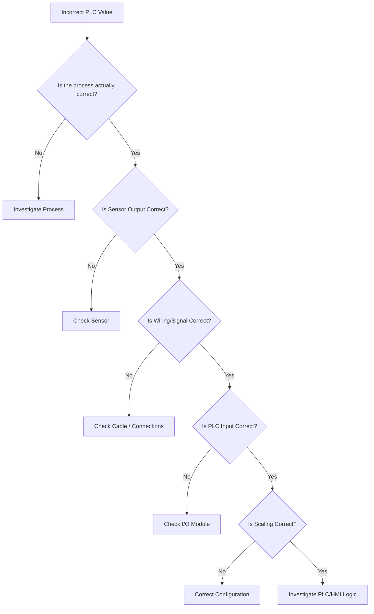

# Signals and Signal Conditioning — What Happens After the Sensor Speaks

[📄👾 Open Interactive Article 07](https://qurvon.github.io/Industrial-Automation-from-First-Principles/01-fundamentals/07-signals-and-signal-conditioning.html)

> A physical quantity becomes useful to an automation system only after it has been represented as a signal that can be transmitted, interpreted, and processed.

Chapter 06 explained how physical reality gets detected. This chapter explains what happens *next* — how that raw, weak, often noisy electrical response is transported, cleaned up, standardized, and finally turned into a number the PLC can act on.

```
Physical World  →  Sensor  →  Raw Signal  →  Signal Conditioning  →  Standard Signal  →  PLC / Controller
```

**Hero example — a realistic temperature-measurement chain:**

```
Temperature
    ↓
RTD
    ↓
Small electrical change (a few ohms)
    ↓
Signal conditioning (amplify, linearize, convert)
    ↓
4–20 mA  ← standardized, transportable signal
    ↓
PLC analog input
    ↓
Digital value
```

Keep that chain in view for the whole chapter — nearly every section below is zooming into one link of it.

---

## Table of Contents

1. [What Is a Signal?](#1-what-is-a-signal)
2. [Information vs. Signal vs. Data](#2-information-vs-signal-vs-data)
3. [Why Signals Have to Travel](#3-why-signals-have-to-travel)
4. [Signal Classification](#4-signal-classification)
5. [Analog Signals](#5-analog-signals)
6. [Current vs. Voltage Signals](#6-current-vs-voltage-signals)
7. [Why 4–20 mA?](#7-why-420-ma)
8. [Live Zero](#8-live-zero)
9. [Voltage Signals — 0–10 V, ±10 V, 1–5 V](#9-voltage-signals--010-v-10-v-15-v)
10. [Discrete Signals](#10-discrete-signals)
11. [Pulse Signals](#11-pulse-signals)
12. [Frequency Signals](#12-frequency-signals)
13. [Signal Conditioning — The Big Concept](#13-signal-conditioning--the-big-concept)
14. [Amplification and Attenuation](#14-amplification-and-attenuation)
15. [Filtering](#15-filtering)
16. [Isolation and Ground Loops](#16-isolation-and-ground-loops)
17. [Shielding and Twisted Pair](#17-shielding-and-twisted-pair)
18. [Differential vs. Single-Ended Measurement](#18-differential-vs-single-ended-measurement)
19. [Linearization](#19-linearization)
20. [Excitation and the Wheatstone Bridge](#20-excitation-and-the-wheatstone-bridge)
21. [Analog-to-Digital Conversion](#21-analog-to-digital-conversion)
22. [Sampling and Aliasing](#22-sampling-and-aliasing)
23. [Scaling — Signal ≠ Raw Count ≠ Engineering Unit](#23-scaling--signal--raw-count--engineering-unit)
24. [Signal Integrity and Signal-to-Noise Ratio](#24-signal-integrity-and-signal-to-noise-ratio)
25. [Fault Detection Through Signals](#25-fault-detection-through-signals)
26. [Complete Real-World Example — Temperature Control](#26-complete-real-world-example--temperature-control)
27. [Signal Troubleshooting Method](#27-signal-troubleshooting-method)
28. [Signal Conditioning in the Full Automation Architecture](#28-signal-conditioning-in-the-full-automation-architecture)
29. [The First-Principles Mental Model](#29-the-first-principles-mental-model)
30. [Research Questions](#30-research-questions)
31. [References](#31-references)

---

## 1. What Is a Signal?

Don't start with 4–20 mA — start with the concept underneath it.

> A signal is a physical representation that carries information about something.

A signal can take many physical forms: voltage, current, resistance, frequency, a pulse train, light intensity, an electromagnetic wave, or encoded digital data. What makes something a *signal*, rather than just a physical event, is that it carries information across space or time to a receiver capable of interpreting it.

```
Information
     ↓
Physical representation
     ↓
      Signal
     ↓
Transmission
     ↓
Receiver
     ↓
Information recovered
```

---

## 2. Information vs. Signal vs. Data

This three-way distinction is one of the most useful mental tools in this entire repository, and it's worth internalizing before anything else.

| Layer | What it means | Example |
|---|---|---|
| **Information** | What we actually want to know | Tank level = 70% |
| **Signal** | The physical representation carrying it | 15.2 mA |
| **Data** | The encoded value the automation system processes | Digital number corresponding to 70% |

```
REALITY
Tank level = 70%
       ↓
INFORMATION
       ↓
SIGNAL
15.2 mA
       ↓
ADC
       ↓
DATA
Digital value
       ↓
PLC
```

Every stage of this chain is a *translation*, and every translation is a place where something can be lost, distorted, or misconfigured — the same warning Chapter 06 raised about sensors applies here with equal force.

---

## 3. Why Signals Have to Travel

The sensor and the controller are almost never in the same place.

```
Process ── Sensor ─────────────────────── PLC
              10 m        50 m       200 m
```

Across that distance, the signal has to survive electrical noise, temperature swings, interference from nearby machinery, grounding differences between buildings, cable attenuation, and whatever else the plant environment throws at it.

> **Core principle:** instrumentation is not simply about detecting something. It is about transporting *trustworthy* information across real distance, in a real electrical environment.

Everything from Section 13 onward — signal conditioning — exists to make that survival possible.

---

## 4. Signal Classification

```
SIGNALS
│
├── Analog
│   ├── Voltage
│   ├── Current
│   └── Resistance
│
├── Discrete
│   ├── ON / OFF
│   └── Pulse
│
├── Frequency
│
├── Time-based
│
└── Digital Communication
    ├── Serial
    ├── Fieldbus
    └── Industrial Ethernet
```

This chapter covers the first four branches in depth. Digital communication protocols get their own dedicated chapter later in this sequence — trying to cover fieldbus and Ethernet properly here would dilute both topics.

---

## 5. Analog Signals

> An analog signal varies continuously with the quantity it represents.

```
Temperature ↑  →  Voltage ↑
```

```
Voltage
  ↑
  │       ╭────╮
  │     ╭─╯    ╰──╮
  │   ╭─╯         ╰─
  └────────────────────→ Time
```

Common industrial forms: **0–10 V**, **±10 V**, **1–5 V**, **4–20 mA**, and raw thermocouple millivolt output.


*A continuously varying analog signal, displayed on an oscilloscope. (Source: Wikimedia Commons, CC BY-SA 4.0)*

---

## 6. Current vs. Voltage Signals

```
Voltage signal:      Sensor ─── cable ─── PLC   (voltage measured across the pair)
Current signal:      Sensor ─── cable ─── PLC   (current measured through the loop)
```

Current transmission became the industrial standard for a practical reason: in a **current loop**, the same current flows through every point in the series circuit regardless of cable resistance, so voltage drop along a long cable run doesn't corrupt the measurement the way it can with a voltage signal. Current loops also enable **live-zero fault detection** (Section 8) and are naturally compatible with simple two-wire, loop-powered transmitters.

---

## 7. Why 4–20 mA?

Chapter 05 introduced this range as a standard. Here's the signal logic behind it:

| Loop current | Represents |
|---|---|
| 4 mA | 0% of range |
| 8 mA | 25% |
| 12 mA | 50% |
| 16 mA | 75% |
| 20 mA | 100% |

The general relationship:

```
I = 4 + 16 × (PV − LRV) / (URV − LRV)
```

where **I** is loop current, **PV** is the process value, **LRV** is the lower range value, and **URV** is the upper range value.

**Example** — a 0–100 °C transmitter: 50 °C sits at the midpoint of the range, so it produces `4 + 16 × 0.5 = 12 mA`.

```
 0 °C  ↔  4 mA
50 °C  ↔ 12 mA
100 °C ↔ 20 mA
```

Every value of temperature in between maps linearly onto a current between 4 and 20 mA — a continuous, standardized translation from physical quantity to transportable signal.


*A 4–20 mA current loop — the same current flows through every device in the series circuit, immune to cable resistance. (Source: Wikimedia Commons)*

---

## 8. Live Zero

Why does 0% of range correspond to **4 mA** rather than **0 mA**? Because it separates *"the process is genuinely at zero"* from *"the signal has failed."*

```
Normal operating range:    4 mA  ──────────────  20 mA
Possible fault condition:  0 mA
```

If the true reading is 0% of range, the loop still carries 4 mA — a live signal the receiving system can validate. A reading of 0 mA, by contrast, is outside the valid range entirely and can be flagged as a probable wiring break, power loss, or instrument fault. This is genuinely useful, but it isn't a universal guarantee: what a specific 0 mA (or under-range) reading actually means still depends on the instrument, the wiring, and how the analog input is configured.

---

## 9. Voltage Signals — 0–10 V, ±10 V, 1–5 V

| Property | 4–20 mA | 0–10 V |
|---|---|---|
| Signal type | Current | Voltage |
| Long-distance industrial use | Excellent | More sensitive to voltage drop / noise |
| Two-wire loop-powered transmitters | Common | Less suited |
| Live zero | Yes | Usually no |
| PLC compatibility | Analog current input | Analog voltage input |

Neither is "better" in the abstract — 0–10 V is entirely appropriate for short runs inside a panel or between nearby devices, where cable length and induced noise are not significant concerns. 4–20 mA earns its dominance specifically in longer industrial runs where a current loop's immunity to cable resistance genuinely matters.

---

## 10. Discrete Signals

The simplest possible signal: binary information.

```
OFF = 0
ON  = 1
```

Examples: a proximity sensor, a limit switch, a push button, a pressure switch, an overload contact.

```
Object absent → 0
Object present → 1
```

```
Sensor → 24V → PLC Digital Input → Input bit
```


*Limit switches — simple mechanical devices that produce a discrete ON/OFF signal. (Source: Wikimedia Commons, CC BY-SA 3.0)*

---

## 11. Pulse Signals

A pulse train carries information through discrete *events* rather than a continuous level.

```
____      ____      ____
    |____|    |____|
```

Applications: encoders, flow meters, speed sensors, counters, position measurement.

```
Number of pulses  → position / count
Pulse frequency   → speed / flow
```

---

## 12. Frequency Signals

```
f = 1 / T
```

where **f** is frequency and **T** is the period between events.

**Example:** 100 pulses per second = 100 Hz. A PLC's high-speed counter can derive motor speed directly from that pulse frequency — the same mechanism used in Chapter 06's encoder case study.

---

## 13. Signal Conditioning — The Big Concept

> Raw sensor outputs are often not directly suitable for a controller.

```
Raw signal → Signal conditioning → Usable signal
```

The conditioning chain can include any combination of: **amplification, filtering, isolation, linearization, excitation, rectification, conversion, scaling, and protection.**

**A concrete example:** a sensor produces 20 mV, but the PLC's input requires 0–10 V.

```
Sensor (20 mV) → Amplifier → Filter → Isolation → 0–10 V → PLC
```

Nothing about that transformation is optional — without it, the PLC simply cannot read the sensor at all.

---

## 14. Amplification and Attenuation

**Amplification** increases signal magnitude so it can be measured reliably:

```
Gain  G = V_out / V_in
```

Example: 10 mV in, 1 V out → **G = 100**.

```
tiny waveform  ~~~~     →  Amplifier  →     large waveform  ══════
```

**Attenuation** is the opposite — deliberately reducing a signal that's too large for the downstream electronics to handle safely:

```
10 V → Attenuator → 1 V
```

---

## 15. Filtering

Every real signal is really two signals superimposed:

```
Real signal = Useful signal + Noise
```

Filtering reduces unwanted frequency components while (ideally) preserving the ones that matter.

```
RAW:       ~~~~~\/~~/\/~~~~~/\/~~
FILTERED:  ──────╭──────╮──────
                  ╰──────╯
```

| Filter type | Passes | Typical industrial use |
|---|---|---|
| **Low-pass** | Slow-changing components | Temperature (changes slowly; noise doesn't) |
| **High-pass** | Fast-changing components | Vibration, transient detection, AC coupling |
| **Band-pass** | A selected frequency range | Machine vibration analysis |
| **Notch** | Everything *except* one narrow band | Suppressing 50/60 Hz power-line interference |

```
Band-pass:
Low frequencies | Target band | High frequencies
████████████████|███████████ |█████████████
                  ↑ keep this
```

A low-pass filter is the natural choice for temperature: the physical quantity itself changes slowly, while electrical noise riding on the signal changes rapidly — filtering out the fast component leaves the slow, real signal intact. A notch filter targeting 50/60 Hz is common where nearby power wiring induces interference — but the right filter always depends on the actual measurement and the actual interference environment, not a generic default.

---

## 16. Isolation and Ground Loops

Industrial systems frequently need **electrical isolation** between the sensor side and the controller side of a circuit.

```
Sensor → [Isolation] → PLC
```

Isolation prevents unwanted current paths, absorbs potential differences between separately-grounded equipment, reduces ground-loop problems, and protects downstream electronics.

**Ground loops** happen when two pieces of equipment are connected by both a signal path *and* a separate ground path, and those two grounds aren't at exactly the same potential:

```
Instrument A ───────── PLC
     │                   │
     └──────  Ground  ───┘
```

That small difference in ground potential drives an unwanted current through the signal path itself, corrupting the measurement.

```
Ground loop present  → noisy, drifting signal
Proper isolation      → clean signal
```


*An isolation transformer breaking the unwanted conductive path between two separately-grounded pieces of equipment. (Source: Wikimedia Commons, CC0)*

---

## 17. Shielding and Twisted Pair

**Shielding** wraps a signal conductor in a conductive layer that intercepts external electrical noise before it reaches the signal wire itself:

```
Signal conductor
      │
Shield ─────────────────
      │
   (noise intercepted here)
```

Good practice covers shielded twisted-pair cable, deliberate cable routing, a defined grounding strategy, and physical separation from power cables. There is no single universal rule for shield termination ("always ground both ends," "always ground only one end") — the right choice depends on the frequencies involved, the specific equipment, and the plant's overall EMC (electromagnetic compatibility) strategy.


*Twisted-pair conductors — each pair experiences similar interference, which differential measurement can then cancel out. (Source: Wikimedia Commons)*

**Why twisting helps:** two conductors running side by side, twisted around each other, pick up very similar electromagnetic interference at any given point along the cable. Because the interference is nearly identical on both wires, a *differential* measurement — reading the difference between the two — cancels most of that shared noise out.

```
────╲╱────╲╱────╲╱────
────╱╲────╱╲────╱╲────
```

---

## 18. Differential vs. Single-Ended Measurement

```
Single-ended:                     Differential:
Signal ─────→ Input                Signal + ───┐
Ground ─────→ Reference                          ├──→ Differential input
                                    Signal − ───┘
```

> Differential measurement responds primarily to the voltage *difference* between two conductors, largely ignoring whatever the two conductors have in common.

This distinction directly explains why industrial analog input cards are so often specified as differential inputs — it's the hardware-level implementation of the twisted-pair noise cancellation described above.

**Common-mode vs. differential-mode noise:**

```
Differential noise (appears between the two signal conductors):
+Signal ───╲╱╲╱───
-Signal ───╱╲╱╲───

Common-mode noise (appears similarly, relative to reference, on both conductors):
+Signal ───~~~~~~
-Signal ───~~~~~~
```

A differential input rejects common-mode noise effectively; it does nothing for differential-mode noise, since that noise *is* part of the signal difference being measured.

---

## 19. Linearization

Real sensors are frequently nonlinear — a thermocouple's voltage doesn't rise in a perfectly straight line with temperature, and neither do many pressure sensors or nonlinear position sensors.

```
Physical quantity
      ↓
Nonlinear sensor response
      ↓
Linearization
      ↓
Engineering value
```

Linearization can happen at several different points in the chain: inside dedicated analog electronics, inside the transmitter itself, in PLC software using a lookup table or polynomial correction, or inside the sensor's own firmware for smart devices. Where it happens matters less than the fact that it happens *somewhere* before the value is trusted.

---

## 20. Excitation and the Wheatstone Bridge

Some sensors are entirely passive and need an external **excitation** signal just to produce a measurable output at all — strain gauges, RTD measurement circuits, and other bridge-based sensors all fall into this category.

```
Excitation → Sensor → Parameter changes → Measurement
```

The classic circuit for extracting a tiny resistance change as a clean voltage is the **Wheatstone bridge**:

```
        +V
         │
    ┌────┴────┐
   R1         R2
    │          │
    ├── Vout ──┤
    │          │
   R3         R4
    └────┬────┘
         │
         0V
```


*A Wheatstone bridge — a tiny resistance change in one arm produces a measurable differential voltage across the bridge. (Source: Wikimedia Commons)*

When all four resistors are equal, the bridge is balanced and `Vout = 0`. Replace one resistor with a strain gauge, and even a microscopic resistance change unbalances the bridge, producing a small but measurable differential voltage proportional to that change. This is exactly the circuit hiding inside most load cells and many pressure sensors — the physical/electronics bridge between Chapter 06's resistive sensing principle and a real, transmittable signal.

---

## 21. Analog-to-Digital Conversion

Somewhere inside the PLC or a DAQ device, the analog signal finally becomes a number.

```
Analog signal → Sample → Quantize → Encode → Digital value
```

**Example:** a 12-bit ADC has `2^12 = 4096` possible output codes. For a 0–10 V input range, the ideal code width is:

```
10 V / 4096 ≈ 2.44 mV per code
```

That's the theoretical *resolution* — the smallest voltage change the converter can distinguish in principle. Real systems add further error on top of this ideal quantization: noise, nonlinearity, and reference-voltage drift all reduce the *effective* resolution below the theoretical number.


*An ADC sampling a continuous signal at discrete instants — each sample is held, then converted to a digital code. (Source: Wikimedia Commons)*

---

## 22. Sampling and Aliasing

> A continuous signal can be represented digitally by measuring it at discrete time intervals.

```
Analog:    ╭────╮
           │    ╰────╮
           │         ╰──

Samples:   •    •    •    •    •
```

Key ideas: **sampling frequency** (how often a sample is taken), **sampling interval** (the time between samples), and the **Nyquist concept** — to faithfully represent a signal, it must be sampled at more than twice the highest frequency component present in that signal.

**Aliasing** is what happens when that condition is violated:

```
Fast waveform  →  insufficient sampling  →  a false, slower-looking waveform
```

> If sampling is too infrequent, genuinely different analog signals can produce identical-looking sampled data — the digital system literally cannot tell them apart.

This is why real acquisition systems place an **anti-aliasing filter** — a low-pass filter tuned to the sampling rate — ahead of the ADC, removing frequency content the sampling rate couldn't represent correctly in the first place.

---

## 23. Scaling — Signal ≠ Raw Count ≠ Engineering Unit

```
4 mA   → 0 °C
12 mA  → 50 °C
20 mA  → 100 °C
```

The PLC ultimately converts a raw signal into something like:

```
Engineering value = 73.5 °C
```

> **Important distinction:** the *signal* (a current or voltage), the *raw PLC count* (whatever number the ADC produced), and the *engineering unit* (°C, bar, RPM) are three genuinely different things, related by a scaling calculation that has to be configured correctly. A perfectly healthy signal, scaled with the wrong range values, still produces a wrong answer.

---

## 24. Signal Integrity and Signal-to-Noise Ratio

> The goal of a signal path is that the value arriving at the controller preserves enough of the original information for the task at hand.

Sources of degradation along the way: noise, attenuation, distortion, interference, grounding problems, poor connections, temperature effects, cable capacitance and inductance, and bandwidth limitations.

**Signal-to-noise ratio (SNR)** quantifies how much the desired signal dominates over noise:

```
SNR = P_signal / P_noise

SNR(dB) = 10 × log₁₀(P_signal / P_noise)
```

Higher SNR generally means the signal of interest is strong relative to the noise riding along with it — a higher-quality, more trustworthy measurement.

---

## 25. Fault Detection Through Signals

```
Normal transmitter output:   4–20 mA

Possible abnormal conditions:
  < 4 mA
  > 20 mA
    0 mA
  unstable / erratic signal
  stuck signal
```

Concepts worth knowing by name: **underrange**, **overrange**, **wire break**, **sensor failure**, and **loss of power** — each tends to produce a characteristic signature on the loop, though the exact thresholds and behaviors depend on the specific instrument and how its input is configured. Signal-based fault detection is a genuinely useful diagnostic tool, not an infallible one.

---

## 26. Complete Real-World Example — Temperature Control

```
Process
  ↓
RTD
  ↓
Resistance change
  ↓
Transmitter
  ↓
4–20 mA
  ↓
Cable
  ↓
PLC Analog Input
  ↓
ADC
  ↓
Raw digital value
  ↓
Scaling
  ↓
Temperature = 72.4 °C
  ↓
PLC Control Logic
  ↓
Output
  ↓
Heater / Valve
```


*An industrial transmitter — the physical device that performs the "signal conditioning → 4–20 mA" step of the chain above. (Source: Wikimedia Commons, CC BY-SA 4.0)*


*A PLC control panel — power supply, CPU, and I/O modules on a DIN rail, the destination of the standardized signal at the end of the chain. (Source: Wikimedia Commons)*

**Now ask:** suppose the temperature is actually 72 °C, but the PLC reads 92 °C. Where could the problem be? Trace the *entire* chain, not just the sensor:

```
Physical process → RTD → Transmitter → 4–20 mA loop
→ Wiring → Analog input → ADC → Scaling → PLC tag → HMI
```

The fault could live at *any* link — a drifted RTD, a miscalibrated transmitter, a corroded wiring connection, damaged shielding picking up noise, or simply a scaling configuration entered with the wrong range values. This is exactly why troubleshooting has to follow the signal path in order, rather than guessing.

---

## 27. Signal Troubleshooting Method



Working through this in order prevents the common mistake of replacing a perfectly good sensor when the actual fault is three steps further down the chain.

---

## 28. Signal Conditioning in the Full Automation Architecture

**Forward path — measurement:**

```
PHYSICAL WORLD
      ↓
   Sensor
      ↓
 Raw signal
      ↓
Signal conditioning
      ↓
Standardized signal
      ↓
 Industrial I/O
      ↓
     PLC
      ↓
   Network
      ↓
 HMI / SCADA
      ↓
    Data
```

**Reverse path — action:**

```
     PLC
      ↓
Output signal
      ↓
Power electronics / drive
      ↓
  Actuator
      ↓
Physical process
```

Together, these two paths are the complete information loop of an automation system — measurement flowing up, action flowing back down. Chapter 09 (Actuators) picks up exactly where the reverse path begins.

---

## 29. The First-Principles Mental Model

```
PHYSICAL REALITY
                     │
                     ▼
               MEASUREMENT
                     │
                     ▼
                  SENSOR
                     │
                     ▼
                RAW SIGNAL
                     │
                     ▼
           SIGNAL CONDITIONING
          ┌──────────┼──────────┐
          ↓          ↓          ↓
      Amplify      Filter     Isolate
          └──────────┼──────────┘
                     ↓
              STANDARD SIGNAL
                     ↓
                    I/O
                     ↓
                   ADC
                     ↓
                   DATA
                     ↓
                CONTROL
                     ↓
                ACTUATOR
                     ↓
              PHYSICAL REALITY
                     ↺
```

> Automation is not simply about moving signals between devices. It is about preserving information while translating physical reality into data, and data back into physical action.

---

## 30. Research Questions

1. What is a signal?
2. What is the difference between information, signal, and data?
3. Why is signal conditioning necessary?
4. Why is 4–20 mA preferred in many industrial applications?
5. What is live zero?
6. What is signal amplification?
7. What is attenuation?
8. Why is filtering necessary?
9. What is a low-pass filter, and why does it suit temperature measurement?
10. Why is electrical isolation required in industrial signal paths?
11. What is a ground loop?
12. Why are twisted-pair cables used?
13. What's the practical difference between differential and single-ended measurement?
14. What is common-mode noise, and how does differential measurement reject it?
15. What is linearization, and where can it be implemented?
16. Why does a strain gauge require excitation?
17. How does a Wheatstone bridge turn a resistance change into a voltage?
18. What determines ADC resolution?
19. What is sampling, and what does the Nyquist concept require?
20. What is aliasing, and why does it demand an anti-aliasing filter?
21. What is signal-to-noise ratio?
22. How does a PLC convert a raw analog signal into an engineering value?
23. At how many distinct points can a measurement signal actually fail?
24. Given a wrong PLC analog value, what is the correct order to troubleshoot it in?

---

## 31. References

- ISA (International Society of Automation) — signal standards and instrumentation practice.
- *Current loop*, Wikipedia — the 4–20 mA standard and live-zero fault detection.
- *Wheatstone bridge*, Wikipedia — bridge-circuit resistance measurement.
- *Nyquist–Shannon sampling theorem*, Wikipedia — sampling rate and aliasing.
- *Signal-to-noise ratio*, Wikipedia — SNR definition and decibel form.
- *Twisted pair*, Wikipedia — differential noise rejection through cable geometry.
- AutomationDirect and NI (National Instruments) technical libraries — analog signal conditioning and DAQ fundamentals.
- Wikimedia Commons — photographs and diagrams, credited individually above each image.

---

**Priveous:** [06 — Actuators and Final Control Elements](06-actuators-and-final-control-elements.md)

**Next:** [08 — Analog vs Digital ](08-analog-vs-digital-1.md)


